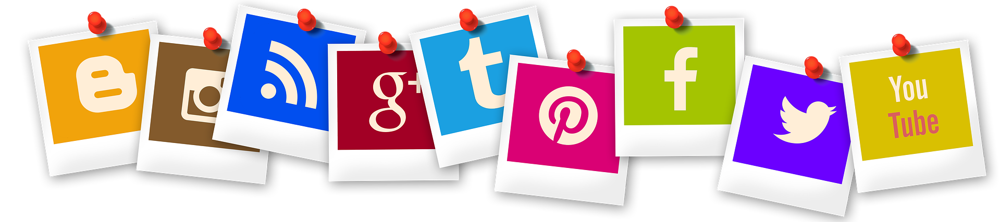
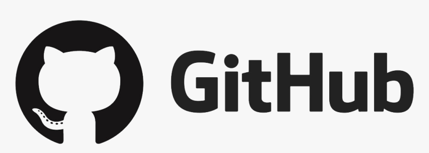
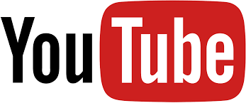
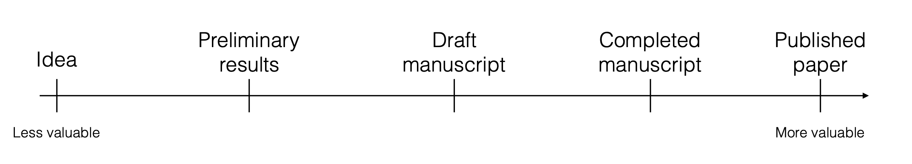

## Motivation

::: columns
::: {.column width="70%"}
* You will likely have many jobs throughout your career.
* Freelance/self-employed jobs keep growing.
* Most good opportunities/jobs are found through connections.
* People (potential collaborators, employers, employees, etc.) will look you up online.
* If you don't control your online presence, you are at the mercy of what shows up.
* **Think of yourself as a "brand".**
:::

::: {.column width="30%"}
{fig-align="center"}
:::
:::

::::{ .fragment}
:::{ .discuss}
**Go ahead and search for yourself online. What comes up?**
:::
::::


## How to build and manage your brand


::: columns
::: {.column width="60%"}
* Create and curate an online presence.
* Create and curate content.
* Develop a _brand identity_, i.e., who you are (professionally and beyond).
:::

::: {.column width="40%"}

](./media/seth_godin.jpg){fig-align="center"}
:::
:::


## Content types
* Created "once", then mostly static: blog posts, longer videos, ...
* Created "once", then updated: your online CV/profile, teaching materials, ...
* Created often, usually static but not very permanent: Bluesky, TikTok, Instagram, ...


::::{ .fragment}
:::{ .discuss}
**What types of online content have you created previously?** 
:::
::::


## Ways to build and manage your online presence
* **General platforms**
* Academia/Science specific platforms
* **Self-built sites**

```{r,  echo=FALSE, fig.cap='[Gerd Altmann](https://pixabay.com/users/geralt-9301/)/Pixabay', out.width = '90%', fig.align='center'}

```


# General Sites

## {.small-font}

```{r linkedin,  echo=FALSE, fig.cap='', out.width = '40%', fig.align='left'}
knitr::include_graphics("./media/linkedin.png")
```

::: columns
::: {.column width="50%"}
* **The** professional networking site. Almost required to be on there. 
* You can customize your profile a good bit.
* A good way to showcase yourself.
* Great for connecting with others.
:::

::: {.column width="50%"}
* LinkedIn is useful even if you are not looking for a job!
* Build a good profile early, not a week before you start applying.
* Some features require a subscription.
* Examples:
  - [Stephanie Eick](https://www.linkedin.com/in/stephanie-eick-phd-mph-50a0b079/)
  - [Katharina Wilkins](https://www.linkedin.com/in/katharinawilkins/)
:::
:::


::::{ .fragment}
:::{ .discuss}
**Who of you is on LinkedIn? (How) do you use it? How up-to-date is your profile?** 
:::
::::


## Employer listings
* Depending on the employer, you might have a company entry.
* Usually not directly controlled by you, not very flexible.
* Use it as needed, but if possible, link to your own main web presence.
* Examples:
  - [Andreas Handel](https://publichealth.uga.edu/faculty-member/andreas-handel/)
  - [Jim Rogers](https://www.metrumrg.com/team_member/james-rogers-ph-d/)


## Social Media

**Facebook, Instagram, TikTok, etc.**

* Widely used.
* Main use is **social**, not professional. But there's overlap.
* Potentially good way to stay connected with others.
* Hard to keep professional and personal lives separated (unless you create 2 accounts).
* Some people use those sites for professional purposes. Less so in academia/research.
* Examples:
  - [UGA Infant Research Lab/Janet Frick](https://www.facebook.com/ugainfantlab/)
  - [Miss Excel](https://www.tiktok.com/@miss.excel)

::::{ .fragment}
:::{ .discuss}
**Has anyone had experiences using social media in a professional setting?** 
:::
::::


## More social media

**Mastodon, Bluesky, X/Twitter, etc.**

* Twitter used to be good for learning about new developments in an area. COVID and Musk ruined it.
* Mastodon and Bluesky are less toxic X alternatives, not quite as good.
* If you engage, you need to decide if you want to mix professional and personal. 
* Consciously decide on the topics you will engage with.
* Learn 'the rules' (tweet/re-tweet/reply/like/hashtags/etc.).


::::{ .fragment}
:::{ .discuss}
**Does anyone use any of these? How do you use it?** 
:::
::::


## Blogging sites

**Medium, Substack, etc.**


* Platforms for blog posts.
* They promote posts, you can reach a wider audience than on your personal blog.
* You can potentially get paid.
* Not all content is freely available, some is behind a paywall.
* Not as much control as on your own website.
* Examples:
  - [Kristian Lum](https://medium.com/@kristianlum)
  - [Melanie Mitchell](https://substack.com/@aiguide)


::::{ .fragment}
:::{ .discuss}
**Does anyone use blogging sites for reading/writing?** 
:::
::::


## 

```{r ,  echo=FALSE, fig.cap='', out.width = '40%', fig.align='left'}

```

:::: {style="display: flex;"}
::: {}
* A great tool to manage projects and work collaboratively.
* Great way to showcase any 'products' you've made.
* Lets you create [simple websites fairly easily](https://www.andreashandel.com/posts/2021-01-11-simple-github-website/).
* Somewhat technical, [takes time to get used to it](https://andreashandel.github.io/MADAcourse/content/module-intro-tools/tools-github-introduction.html).
:::
::: {}
* Showing you know/use GitHub is a desirable skill by itself.
* [Great perks for students](https://education.github.com/pack).
* Examples:
  - [Awsome Data Science](https://github.com/academic/awesome-datascience)
  - [Basic stats course](https://tinystats.github.io/teacups-giraffes-and-statistics/index.html)
  - [MADA](https://andreashandel.github.io/MADAcourse/)
:::
::::

::::{ .fragment}
:::{ .discuss}
**Anyone using GitHub? How do you use it?** 
:::
::::


## 


```{r ,  echo=FALSE, fig.cap='', out.width = '40%', fig.align='left'}

```

:::: {style="display: flex;"}
:::{.column}
* Good for teaching, also useful for outreach.
* You can create your own channels for specific projects.
* In these days of online conferences, your presentation might be recorded. Link to it.
:::
:::{.column}
* Examples:
  - [StatQuest with Josh Starmer](https://www.youtube.com/@statquest)
  - [David Robinson](https://www.youtube.com/@safe4democracy)
:::
::::

::::{ .fragment}
:::{ .discuss}
**Anyone producing YouTube content? Or regularly consuming scientific/professional YouTube content?** 
:::
::::


## Podcasts
* Very popular these days.
* Seem like a lot of work (though maybe less than Youtube).
* Be clear about goals and commitment (e.g. format/posting frequency) before you start.
* Examples:
  - [Not so Standard Deviations](https://nssdeviations.com/)
  - [Casual Inference](https://casualinfer.libsyn.com/)

::::{ .fragment}
:::{ .discuss}
**Anyone making/consuming scientific/professional podcasts?** 
:::
::::


# Academia/Science specific sites

## Academia/Science specific sites
* Google Scholar
* ORCID
* ResearchGate
* Academia.edu
* Mendeley
* ImpactStory
* Publons
* ...

## Google Scholar 
* Only for publications (broadly speaking).
* Gives citation metrics.
* Is fairly automated, you have to do very little.
* Great way to keep track of your papers.
* Examples:
  - [Natalie Dean](https://scholar.google.com/citations?hl=en&user=H7nim_oAAAAJ&inst=15365353816232672843)
  - [Catherine Beauchemin](https://scholar.google.ca/citations?user=DaDJG8kAAAAJ&hl=en&inst=15365353816232672843)

__If I want to get a quick idea what research someone does in academia, I check their Google Scholar page. If they don't have one, I'm annoyed.__

## ORCID
* Gives you a unique ID to track your research productivity.
* Used by a lot of journals.
* Very useful if you have a (slightly) common name (but even if not).
* Free and not-for-profit.
* __If you plan on staying in academia/research, you should set up ORCID.__
* Examples:
  - [Stephanie Eick](https://orcid.org/0000-0001-6695-3291)
  - [Andrew Heiss](https://orcid.org/0000-0002-3948-3914)


## ResearchGate/Academia/Mendeley/etc.
* Types of academic social network sites.
* All are commercial (as far as I know).
* You have various levels of control of how your profile looks like.
* Examples:
  - [Stephanie Eick](https://www.researchgate.net/profile/Stephanie_Eick)


::::{ .fragment}
:::{ .discuss}
**Anyone using any of those sites, if yes how?** 
:::
::::


<!-- _Personally, I haven't found those sites useful. I deleted my accounts on those sites since I want to control my web presence and don't want to keep too many sites up-to-date._ -->


## ImpactStory/Kudos/Publons/etc. 
* Sites that try to measure your 'impact'.
* Maybe fun, but I haven't found them too useful (yet).
* As metrics beyond grants/papers become more important, sites like these might become more useful.

* Examples:
  - [Alison Hill](https://profiles.impactstory.org/u/0000-0002-8082-1890)
  - [Andreas Handel](https://profiles.impactstory.org/u/0000-0002-4622-1146)


# Your own site


## Own website
* You have complete control.
* You have to build and maintain it yourself.
* Lot's of ways to do that. Many are free.

::::{ .fragment}
:::{ .discuss}
**Who has their own website? How did you make it, how do you use/maintain it?** 
:::
::::


## Website builders
* Google Sites, Wordpress, Wix,...
* Some free, some paid, some ads
* Limited flexibility for free versions
* Usually easy to use
* Examples:
  - [Katia Koelle (Wordpress)](https://scholarblogs.emory.edu/koellelab/)
  - [Micaela Martinez (Wordpress)](https://memartinez.org/)
  - [Emily Ricotta (Wix)](https://www.emilyricotta.com/)

## Build your own
* Using some software stack to make your own website
* More flexibility
* Usually a bit more technically challenging
* Fairly easy these days using [Quarto](https://quarto.org/docs/websites/)
* Examples:
  - [Zane Billings](https://wzbillings.com/)
  - [Jadey Ryan](https://jadeyryan.com/)
* Resources:
	- [Nice tutorial](https://jadeyryan.com/blog/2024-02-19_beginner-quarto-netlify/) and [a short summary](https://wzbillings.com/posts/2024-07-13-quarto-website-checklist/)

# General thoughts and suggestions

## Have a plan
* Decide what you want to be known for, create and curate content accordingly. 
* Start with an overall goal/idea for your site(s) before you create them.
	- Why are you doing this?
  - What do you (not) want to put out there?
  - What do you (not) want to be known for?
  - Who is (not) your audience?
  - What is (not) the purpose of your online presence?

## Be picky
* Give some thought to the platforms you want to (not) use.
* Better have fewer online outlets that you keep up-to-date with good quantity/quality content than being on too many platforms.
* You don't need to duplicate, e.g. you can/should link sites (e.g. link to your Google Scholar publications from LinkedIn).
* Adopt the platforms that work for you (e.g. LinkedIn vs. Youtube vs. Blog vs. TikTok vs...)


## Be consistent
* In general, stick to "your" topics. If you are known for topics X and Y, the decision to talk about Z should be planned/deliberate.
* Start simple/easy/slow, then ramp up. Better an update a month than a month long 'binge' followed by a year of no updates. 
* Be consistent. One blog post/video/piece of content a week for a year is better than 52 in a single week and nothing else after that.

**Occasional changes in overall content/structure/frequency are ok, but try to be deliberate.**

## Content is king
* You can spend/waste a lot of time fiddling with the layout and styling (trust me, I've done that).
* In the end, good content is what matters most.
* Examples:
  - [Jeff Leek](http://jtleek.com/)
  - [Seth Godin](https://seths.blog/)


## If in doubt, make it public
* Anything that might be useful to others (or your future self) is worth putting out there.
* Things don't always need to be polished, but you should have some minimum standard of quality.

{width=70% fig-align="center"}

](./media/public-work.png){width=70% fig-align="center"}


## Some advertising helps
* If people don't find you, your impact is low.
* Cross-link to your various online locations.
* Use platforms to promote your content (e.g. LinkedIn).
* Don't worry too much about search engine optimization (SEO). If you create good and persistent content, you should soon show up on top.


## Keep track (a little bit)
* Set Google alerts for your name (or other keywords).
* Consider measuring your impact (e.g. Site visits, Software downloads, Twitter followers, GitHub stars).
* Those metrics can be useful for career advancement, but don't get too hung up about them.
* Examples:
  - [DSAIDE R package](https://ahgroup.github.io/DSAIDE/)
  

## Warnings
* Anything you put online is there "forever", even if you delete it later.
* Be professional, even if you decide to post content that's not directly career related.
* Online can be a HUGE time and attention suck!

**Always be mindful of the ultimate reason for having an online presence/brand. Let that guide the quality and quantity of your online activities.**


## Summary

**You need an online presence that you control.**

* Minimum: Decent LinkedIn site, maybe augmented with Google Scholar or similar. 
* Better:  Also own website with links to your other online outlets.
* Advanced: Also become active on certain platforms (regular blogs/videos/podcasts/tweets, etc.).

