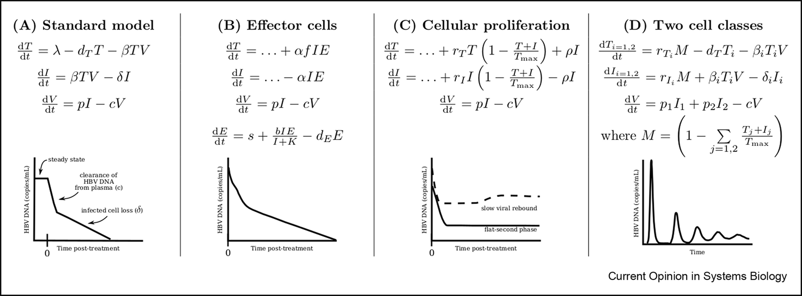
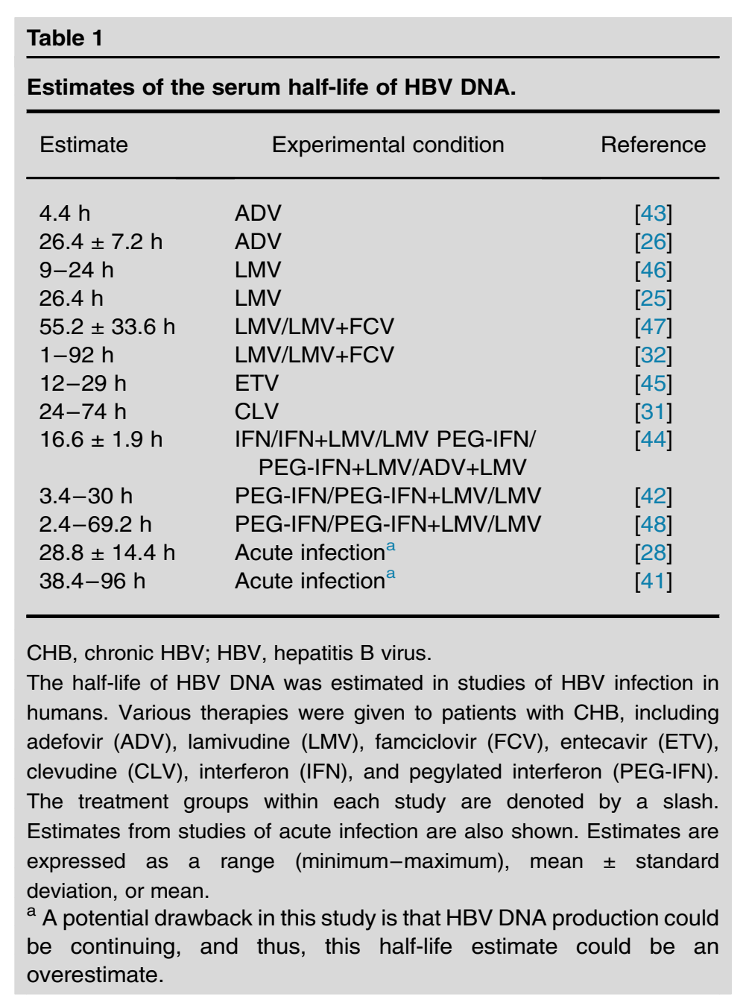
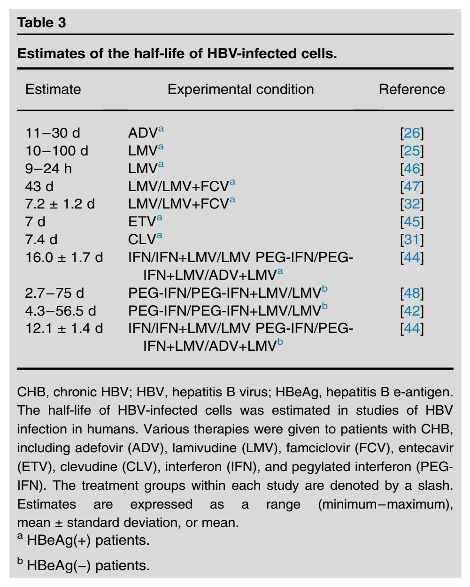

## HBV modeling

- Similar to other chronic viruses (HIV, HCV)
- [Reviewed here](https://pubmed.ncbi.nlm.nih.gov/31930181/)

## HBV models

{fig-align="center"}

## Model parameter estimates

{fig-align="center"}

## Model parameter estimates

{fig-align="center"}

## Summary

HBV models have been used to estimate the impact of therapy/interventions, and to estimate biologically relevant quantities (e.g. lifespan of virus and infected cells).
