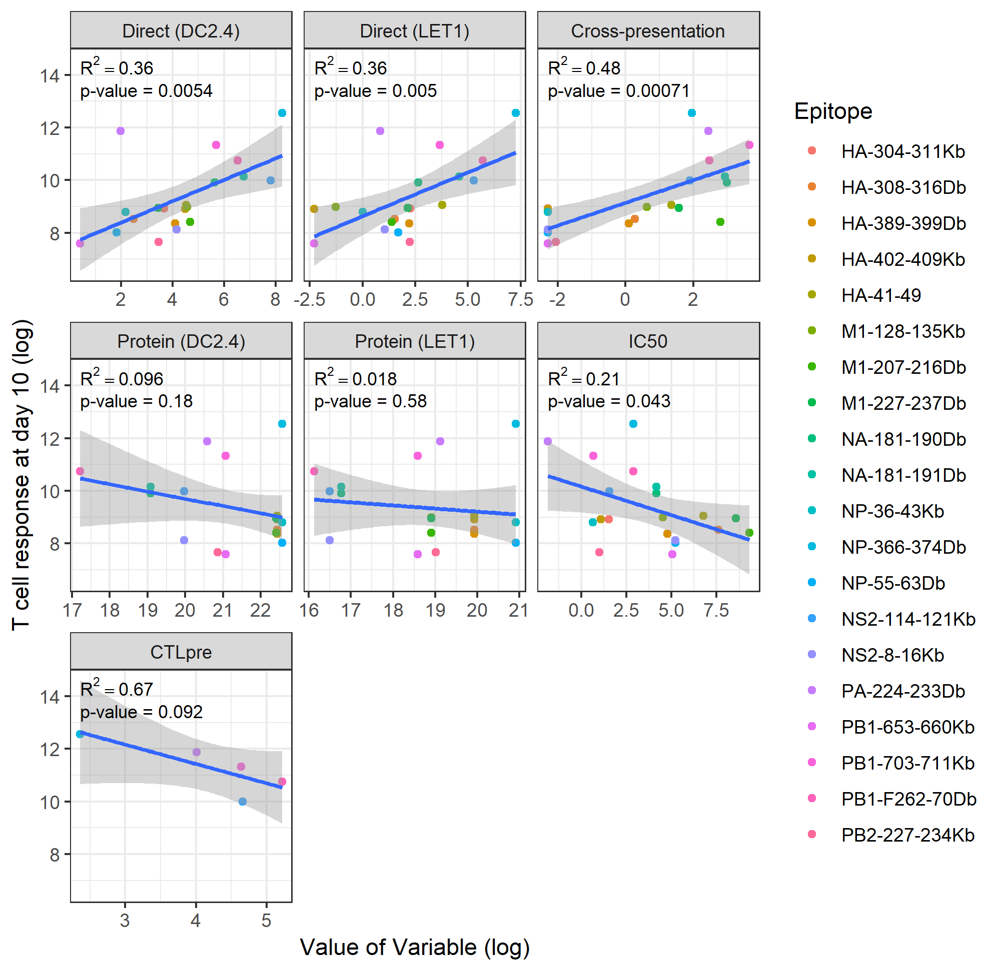
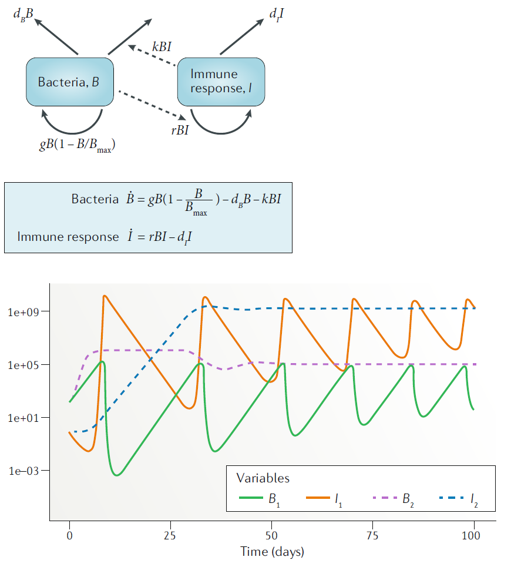
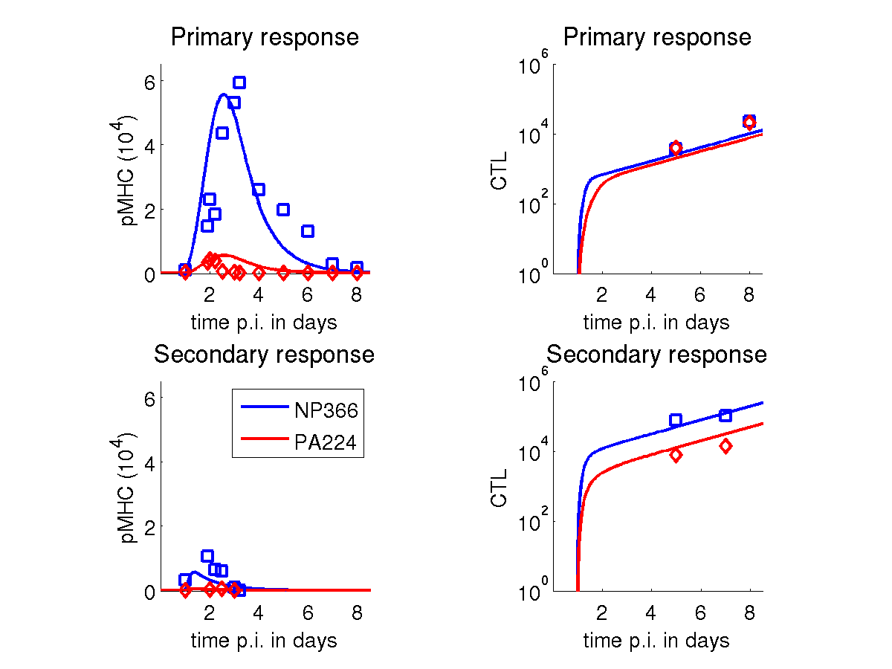
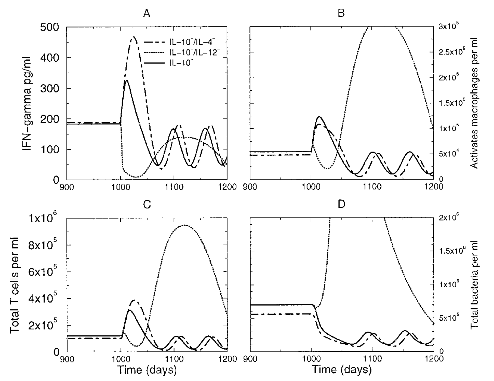
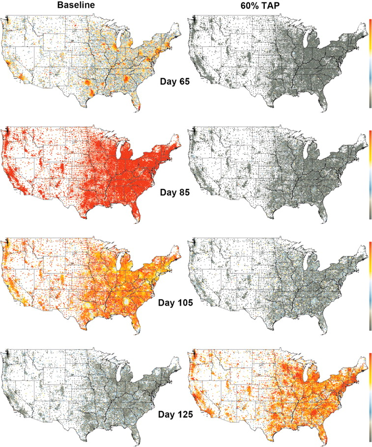

## Modeling definition

* The term __modeling__ usually means (in science) the description and analysis of a system using mathematical or computational models. 
* Many different types of modeling approaches exist. Simulation models are one type (with many subtypes).

](./media/xkcd_algorithm_help.png)

## A way to classify models

* __Phenomenological/non-mechanistic/heuristic/(statistical) models__
  * Look at patterns in data
  * Do not describe mechanisms leading to the data
* __Mechanistic/process/simulation models__
  * Try to represent simplified versions of mechanisms
  * Can be used with and without data

## Phenomenological models

:::: {.columns}
::: {.column width="50%"}
* You might be familiar with statistical models (that includes Machine Learning, AI, Deep Learning,...).
* Most of those models are phenomenological/non-mechanistic (and static).
* Those models are used extensively in all areas of science.
* The main goal of these models is to understand data/patterns and make predictions.
:::

::: {.column width="50%"}
](./media/xkcd-curve_fitting.png){width="70%" fig-align="center"}
:::
::::

## Non-mechanistic model example

{width="70%" fig-align="center"}

## Non-mechanistic models - Advantages

* Finding correlations/patterns is (relatively) simple.
* Some models are very good at predicting (e.g. Netflix, Google Translate).
* Sometimes we can go from correlation to causation.
* We don't need to understand all the underlying mechanisms to get actionable insights.

](./media/xkcd-correlation-causation.png)

## Non-mechanistic models - Disadvantages

:::: {.columns}
::: {.column width="50%"}
* The jump from correlation to causation is always tricky (bias/confounding/systematic errors). 
* Even if we can assume a causal relation, we do not gain a lot of mechanistic insights or deep understanding of the system.
:::

::: {.column width="50%"}
](./media/xkcd-machine_learning.png){width="80%" fig-align="center"}
:::
::::

## Mechanistic models

:::: {.columns}
::: {.column width="50%"}
* We formulate explicit mechanisms/processes driving the system  dynamics.
* This is done using mathematical equations (often ordinary differential equations), or computer rules.
* Also called __systems/dynamic(al)/ (micro)simulation/process/ mathematical/ODE/... models__.
:::

::: {.column width="50%"}
{width="90%" fig-align="center"}
:::
::::

## Mechanistic model example 

$$
\begin{aligned}
\textrm{virus:} & \qquad  \dot V  =  rV-kVT^*, \qquad \qquad \textrm{pMHC:} \qquad  \dot P  =  fV - dP \\
\textrm{naive T-cell:} & \qquad  \dot T  =  -aPT, \qquad \qquad \textrm{activated T-cell:} \qquad  \dot T^*  =  aPT + gT^*
\end{aligned}
$$

{width="100%" fig-align="center"}

## Mechanistic models - Advantages

* We get a potentially deeper, mechanistic understanding of the system.
* We know exactly how each component affects the others in our model.

{width="90%" fig-align="center"}

## Mechanistic models - Disadvantages

* We need to know (or assume) something about the mechanisms driving our system to build a mechanistic model.
* If our assumptions/models are wrong, the "insights" we gain are spurious.

{width="90%" fig-align="center"}

## Non-mechanistic vs Mechanistic models 
* Non-mechanistic models (e.g. regression models, machine learning) are useful to see if we can find patterns in our data and possibly predict, without necessarily trying to understand the mechanisms.
* Mechanistic models are useful if we want to study the mechanism(s) by which observed patterns arise.

**Ideally, you want to have both in your 'toolbox'.**    

## Simulation models
* We will focus on __mechanistic simulation models.__
* The hallmark of such models is that they explicitly (generally in a simplified manner) model processes occuring in a system. 

## Simulation modeling uses

:::: {.columns}
::: {.column width="50%"}
* Weather forecasting.
* Simulations of a power plant or other man-made system.
* Predicting the economy.
* Infectious disease transmission.
* Immune response modeling.
* ...
:::

::: {.column width="50%"}
](./media/xkcd-scenario-forcasting.png)
:::
::::

## Real-world examples
Using a TB model to explore/predict cytokine-based interventions (Wigginton and Kirschner, 2001 J Imm).

{fig-align="center"}

## Real-world examples
Targeted antiviral prophylaxis against an influenza pandemic (Germann et al 2006 PNAS).
{width="40%" fig-align="center"}

## Within-host and between-host modeling

Within-host/individual level | Between-host/population level |
---------- | ---------- |
Spread inside a host (virology, microbiology, immunology) | Spread on the population level (ecology, epidemiology) |
Populations of pathogens & immune response components | Populations of hosts (humans, animals) |
Acute/Persistent (e.g. Flu/TB) | Epidemic/Endemic (e.g. Flu/TB) |
Usually (but not always) explicit modeling of pathogen | Often, but not always, no explicit modeling of pathogen |

The same types of simulation models are often used on both scales.

## Population level modeling history

* 1766 - Bernoulli "An attempt at a new analysis of the mortality
caused by smallpox and of the advantages of inoculation to
prevent it" (see Bernoulli & Blower 2004 Rev Med Vir)
* 1911 – Ross "The Prevention of Malaria"
* 1920s – Lotka & Volterra "Predator-Prey Models"
* 1926/27 - McKendrick & Kermack "Epidemic/outbreak models"
* 1970s/80s – Anderson & May
* Lot’s of activity since then
* See also Bacaër 2011 "A Short History of Mathematical Population Dynamics"

## Within-host modeling history

* The field of within-host modeling is somewhat recent, with early attempts in the 70s and 80s and a strong increase since then.
* HIV garnered a lot of attention starting in the late 80s, some influential work happened in the early 90s.
* Overall, within-host models are still less advanced compared to between-host modeling, but it's rapidly growing.

# A few simple models

## A simple simulation model
* We'll start with a very simple model, a population of entities (pathogens/immune cells/humans/animals) that grow or die.
* We'll implement the model as a discrete time equation, given by:

$$
P_{t+dt} = P_t + dt ( g P_t - d_P P_t )
$$

* $P_t$ are the number of pathogens in the population at current time $t$, $dt$ is some time step and $P_{t+dt}$ is the number of pathogens in the future after that time step has been taken.
* The processes/mechanisms modeled are growth at rate $g$ and death at rate $d_P$.

## A simple simulation model
* Assume we have a population of individuals (e.g., pathogens) that grow at a rate of $g=12$ and die at rate of $d_P=2$ (per some time unit, e.g. days or weeks or years).
* If we started with 100 individuals (pathogens) at time t=0 and took time steps of $dt=1$, how many individual would we have after 1,2,3... time units?

$$
P_{t+dt} = P_t + dt ( g P_t - d_P P_t )
$$

## A simple simulation model - variant 1
Original:

$$
P_{t+dt} = P_t + dt ( g P_t - d_P P_t )
$$
Alternative:

$$
P_{t+dt} = P_t + dt ( g - d_P P_t )
$$
What's the difference? Is this a good (biologically potentially reasonable) model?

## A simple simulation model - variant 2
Original:

$$
P_{t+dt} = P_t + dt ( g P_t - d_P P_t )
$$
Alternative:

$$
P_{t+dt} = P_t + dt ( g P_t - d_P)
$$

What's the difference? Is this a good (biologically potentially reasonable) model?

## Discrete time models

$$
P_{t+dt} = P_t + dt ( g P_t - d_P P_t )
$$

* The model above is updated in discrete time steps (to be chosen by the modeler).
* Good for systems where there is a "natural"" time step. E.g. some animals always give birth in spring or some bacteria divide at specific times.
* Used in complex individual based models for computational reasons.
* For compartmental models where we track the total populations (instead of individuals), continuous-time models are more common. They are usually formulated as ordinary differential equations (ODE).
* If the time-step becomes small, a discrete-time model approaches a continuous-time model.

## Continuous time models

Discrete:

$$
P_{t+dt} = P_t + dt ( g P_t - d_P P_t )
$$
Re-write:

$$
\frac{P_{t+dt} - P_t}{dt} =  g P_t - d_P P_t 
$$

Continuous (dt -> 0):
$$
\frac{dP}{dt}  = gP - d_P P
$$

* If we simulate a continuous time model, the computer uses a smart discrete time-step approximation.

## Some notation
The following are 3 equivalent ways of writing the differential equation:

$$
\begin{aligned}
\frac{dP(t)}{dt}  &= gP(t) - d_P P(t) \\
\frac{dP}{dt}  &= gP - d_P P \\
\dot{P}  &= gP - d_P P \\
\end{aligned}
$$
We will use the 'dot notation'.

## Some terminology

$$
\dot{P}  = gP - d_P P
$$

* The left side is the change in time of the indicated variable.
* Each term on the right side represents a (often simplified/abstracted) biological process/mechanism.
* Any positive term on the right side is an inflow and leads to an increase of the indicated variable.
* Any negative term on the right side is an outflow and leads to a decrease of the indicated variable.

## Extending the model 

$$
\dot{P}  = gP - d_P P
$$

For different values of the parameters _g_ and $d_P$, what broad types of dynamics/outcomes can we get from this model?  

## Extending the model 

$$
\dot{P}  = gP - d_P P
$$

How can we extend the model to get growth that levels off as we reach some high level of $P$?

## Model with saturating growth 
$$
\dot{P}  = gP(1-\frac{P}{P_{max}}) - d_P P
$$

* We changed the birth process from exponential/unlimited growth to saturating growth. $P_{max}$ is the level of $P$ at which the growth term is zero. 
* If $P > P_{max}$, the growth term is negative. 
* The population settles down at a level where the growth balances the decay, i.e. when $gP(1-\frac{P}{P_{max}}) = d_P P$.

## Adding a second variable

* A single variable model is 'boring'.
* The interesting stuff happens if we have multiple compartments/variables that interact.
* Let's introduce a second variable.
* Let's assume that _P_ is a population of some bacteria (but could also be some animal), which gets attacked and consumed by some predator, e.g. the immune system or another animal. We'll pick the letter _H_ for the predator (any label is fine). 

## Adding a second variable
$$
\begin{aligned}
\dot{P} & = gP(1-\frac{P}{P_{max}}) - d_P P \ \pm \ ?\\
\dot{H} & = ?
\end{aligned}
$$

* The predator attacks/eats the prey. What process could we add to the _P_-equation to describe this?

## Adding a second variable
$$
\begin{aligned}
\dot{P} & = gP(1-\frac{P}{P_{max}}) - d_P P - kPH\\
\dot{H} & = ?
\end{aligned}
$$

* The more _P_ there is, the more the predator will grow, e.g. by eating _P_ or by receiving growth signals. 
* What term could we write down for the growth dynamics of _H_?
* Finally, _H_ individuals have some life-span after which they die. How can we model this?

## Predator-prey model

The model we just built is a version of the well-studied predator-prey model from ecology.
$$
\begin{aligned}
\dot{P} & = g_P P(1-\frac{P}{P_{max}}) - d_P P - kPH\\
\dot{H} & = g_H P H - d_H H
\end{aligned}
$$

The discrete-time version of the model is:
$$
\begin{aligned}
P_{t+dt} & = P_t + dt(g_P P_t(1-\frac{P_t}{P_{max}}) - d_P P_t - kP_tH_t)\\
H_{t+dt} & = H_t + dt( g_H P_t H_t - d_H H_t)
\end{aligned}
$$

## Bacteria and immune response model

The names of the variables and parameters are arbitrary. If we think of bacteria and the immune response, we might name them _B_ and _I_ instead.

$$
\begin{aligned}
\dot{B} & = g B(1-\frac{B}{B_{max}}) - d_B B - kBI\\
\dot{I} & = r BI - d_I I
\end{aligned}
$$
$$
\begin{aligned}
B_{t+dt} & = B_t + dt(g B_t(1-\frac{B_t}{B_{max}}) - d_B B_t - k B_t I_t)\\
I_{t+dt} & = I_t + dt( r B_t I_t - d_I I_t)
\end{aligned}
$$

## Graphical model representation

* It is important to go back and forth between words, diagrams, equations.
* Diagrams specify a model somewhat, but not completely. The diagram below could be implemented as ODEs or discrete time or stochastic models.

{width="80%" fig-align="center"}

## Model exploration

* We could analyze the model behavior with 'pencil and paper' (or some software, e.g. Mathematica/Maxima). This only works for simple models. 
* We could analyze the model behavior by simulating it.
* To simulate, we need to implement the model on a computer, specify starting (initial) conditions for all variables and values for all model parameters.
* We'll do those explorations shortly.

{width="100%" fig-align="center"}

## Homework

* If you haven't already, install DSAIRM and take a look at the _Basic Virus Model_ and _Basic Bacteria Model_ apps. 
* Start looking at and going through the "What to do" tasks. You can try yourself first (better for learning), or look at the solutions right away (only suggested if you feel completely lost).
* Take an especially close look at the solution for task 6 in the _Basic Bacteria_ app, we will use a similar approach tomorrow.
* Links to solution files are in the schedule of the class website. 
