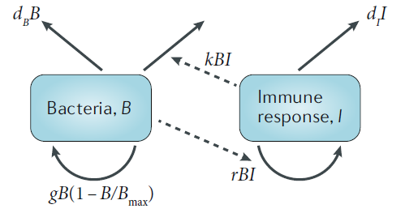
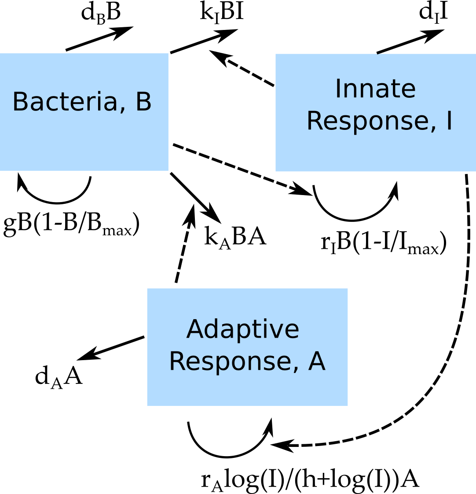
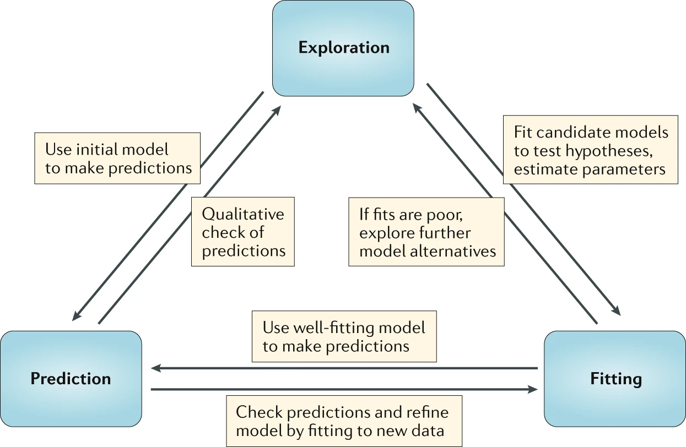
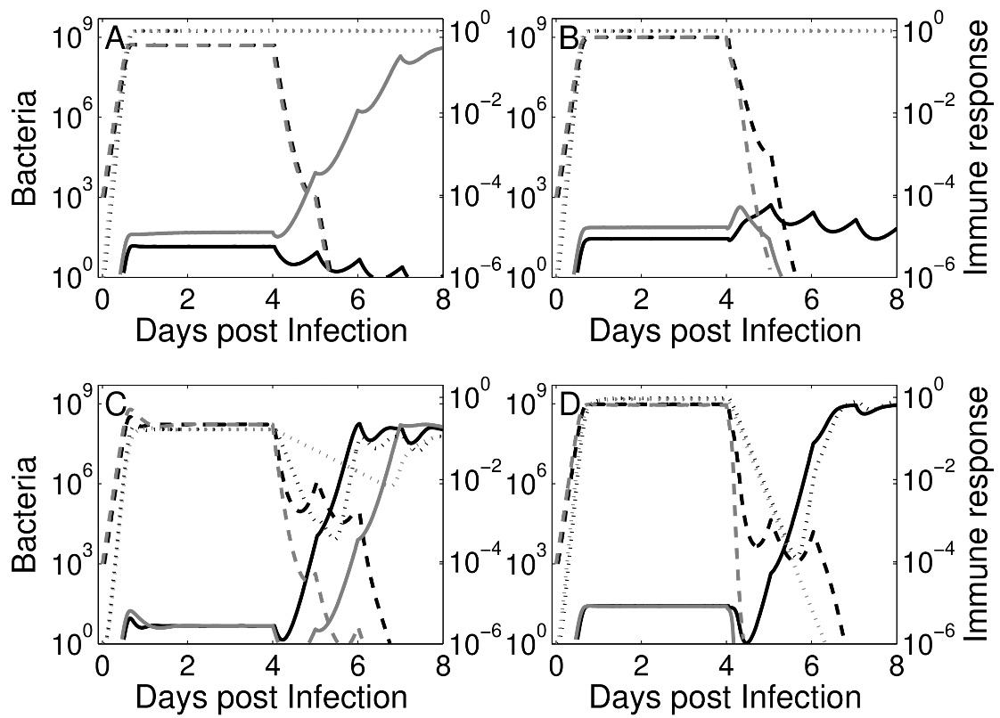
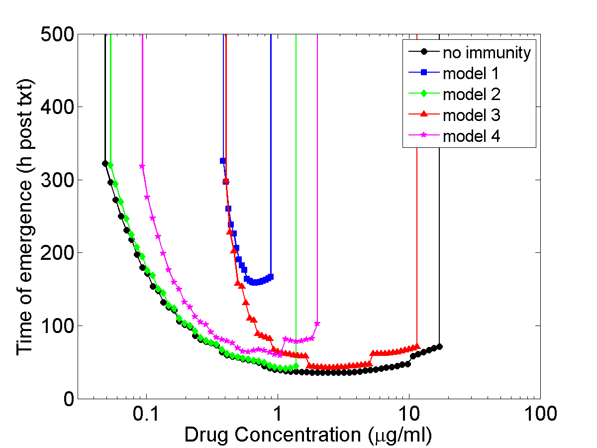
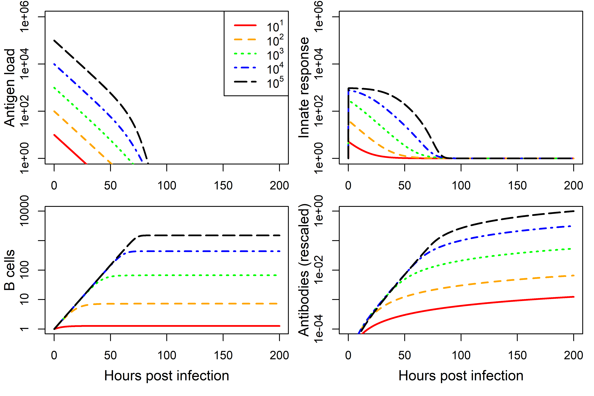
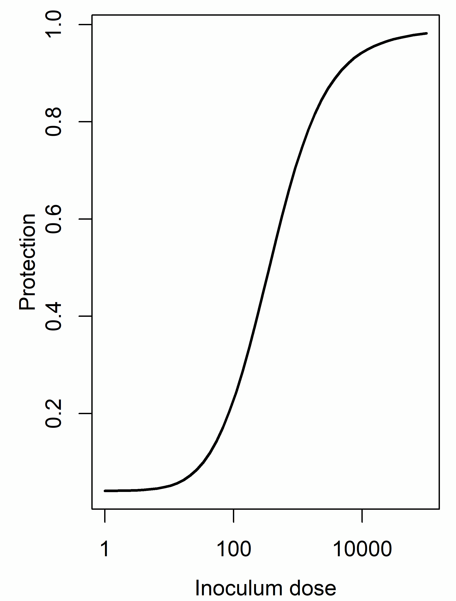
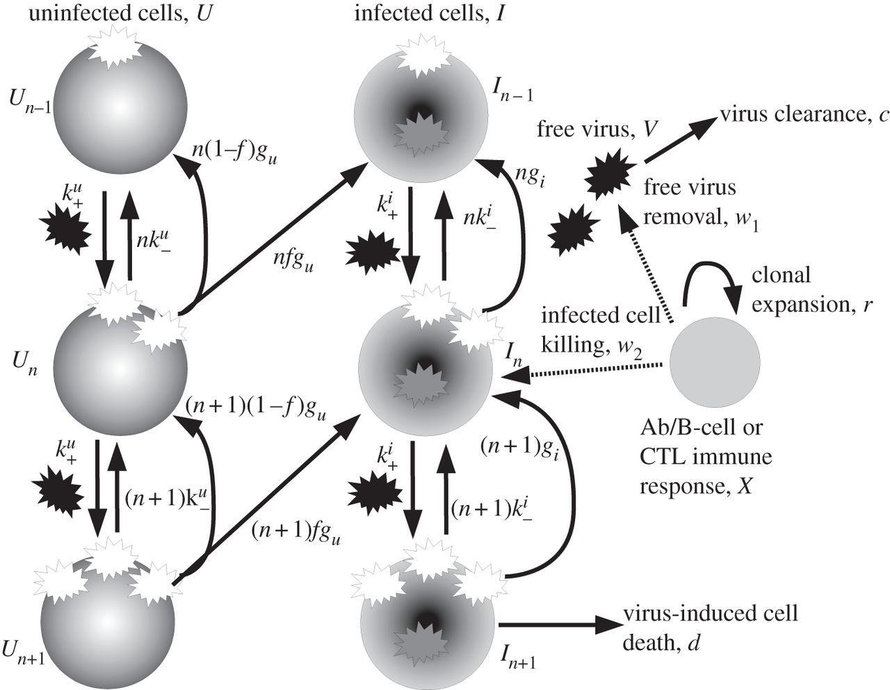
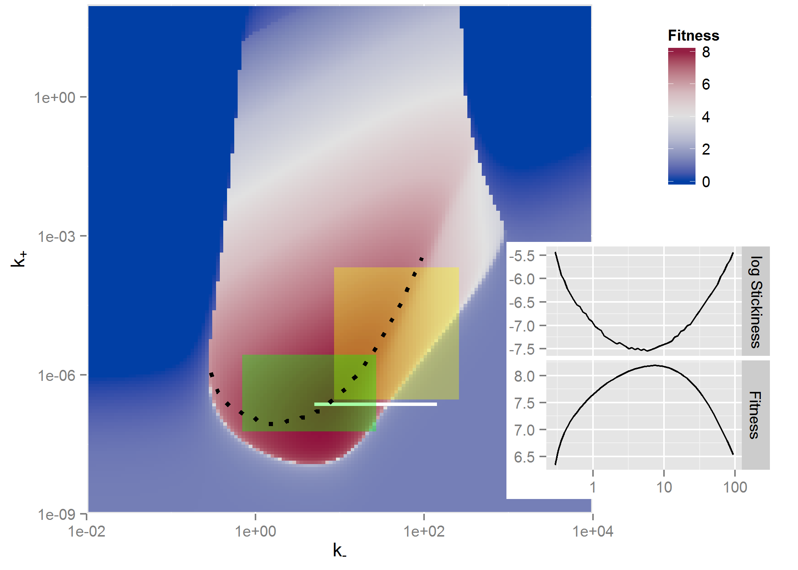

## Basic bacteria infection model

```{r bacteriadiagram,  fig.cap='',  echo=FALSE, out.width = "80%", fig.align='center'}

```

$$
\begin{aligned}
\dot{B} & = g B(1-\frac{B}{B_{max}}) - d_B B - kBI\\
\dot{I} & = r BI - d_I I
\end{aligned}
$$

-   Can also be other extracellular organisms. Probably not ideal for intra-cellular bacteria (e.g., TB).

## Extended bacteria infection model

```{r bacteriadiagram2,  fig.cap='',  echo=FALSE, out.width = "80%", fig.align='center'}

```

```{=tex}
\begin{align}
\dot B &= g B (1-\frac{B}{B_{max}}) - d_B B - k_I B I - k_A B A \\
\dot I &= r_I B (1 -\frac{I}{I_{max}} )  - d_I I \\
\dot A &= r_A \frac{\log(I)}{h+\log(I)} A  - d_A A
\end{align}
```
## Model uses

```{r modelusefig,  echo=FALSE, fig.cap='', out.width = '90%', fig.align='center'}

```

## Model Exploration

-   Looking at the dynamics (time-series) of a model can be useful.
-   Often, we are not mainly interested in the time series, but instead some more specific quantity, e.g. total number of pathogen/infected cells, steady state values, etc.
-   We usually want to to know how such outcome(s) of interest vary with some parameter(s).
-   What do we need to do to answer that question?

## Model Exploration

1.  Choose some parameter values.
2.  Run the simulation model.
3.  Record quantities/outcomes of interest.
4.  Choose another set of parameter values (usually we only vary one at a time).
5.  Repeat steps 2-4 until you got all parameter-outcome pairs of interest.
6.  Report (e.g. plot) your findings.


## Model Exploration example 1

-   Question: How does drug dosing impact the emergence of drug resistance in the presence of different types of immune responses?
-   Approach: Build several simple models and explore (after [Handel et al 2009 JTB](http://dx.doi.org/10.1016/j.jtbi.2008.10.025)).


$$
\begin{aligned}
\dot{B_s} & = (1-\mu)g_s B_s(1-\frac{B_s+B_r}{B_{max}})  -k_I I B_s - \frac{k_s C}{C+C_{50}^s} B_s\\
\dot{B_r} & = (\mu g_s B_s + g_r B_r)(1-\frac{B_s+B_r}{B_{max}})  -k_I I B_r - \frac{k_r C}{C+C_{50}^r} B_r\\
\dot{I} & = r (B_s+B_n)-d_I I   \\
\dot C & =  - d_C C, \qquad C=C+C_0 \textrm{ at } t = t_{interval} \\
\end{aligned}
$$

## Model Exploration example 1




## Model Exploration example 1

- Vary drug concentration, explore time for resistance to emerge.




## Model Exploration example 2

-   Question: How dose the antigen dose for a killed (influenza) vaccine affect antibody levels post vaccination?
-   Approach: Build a simple model and explore (after [Handel et al 2018 PCB](https://journals.plos.org/ploscompbiol/article?id=10.1371/journal.pcbi.1006505)).

$$
\begin{aligned}
\dot V &=  - d_V V  - k_A AV \\
\dot F &= p_F - d_F F + \frac{V}{V+ h_V}g_F(F_{max}-F)  \\ 
\dot B & = \frac{F V}{F V + h_F} g_B B \\
\dot A & = r_A B - d_A A - k_A A V
\end{aligned}
$$ (This is a simpler version of the virus and immune response DSAIRM model.)

## Model Exploration example 2

Run model for different antigen doses ($V_0$).

```{r inoc1,  fig.cap='',  echo=FALSE, out.width = "90%", fig.align='center'}

```

## Model Exploration example 1

::: columns
::: {.column width="50%"}
-   Run model for different $V_0$, record antibodies $A$ at end of each simulation for each $V_0$.
-   Use this equation to compute protection as a function of antibody level. $P= 1 - \frac{1}{e^{k_1(\log(A)-k_2)}}$
:::

::: {.column width="50%"}
```{r inoc2,  fig.cap='',  echo=FALSE, out.width = "90%", fig.align='center'}

```
:::
:::

<!-- ## Model Exploration - Example 2 -->

<!-- ::: columns -->
<!-- ::: {.column width="50%"} -->
<!-- ```{r stickiness1,  echo=FALSE,  fig.align='center'} -->
<!--  -->
<!-- ``` -->
<!-- ::: -->

<!-- ::: {.column width="50%"} -->
<!-- ```{r stickiness2,  echo=FALSE,  fig.align='center'} -->
<!--  -->
<!-- ``` -->
<!-- ::: -->
<!-- ::: -->

<!-- Virus fitness as function of virion binding ( $k_+$ ) and release ( $k_-$ ) rates. [Handel et al (2014) Proc Royal Soc Interface](http://rsif.royalsocietypublishing.org/content/11/92/20131083). -->

## Exploration comments

-   If the system/question is very simple, we might not need a model.
-   Interactions among pathogens and the immune response are often complex. If we know little about our system and its behavior, building and exploring simple models is often a useful first step.


## Back to bacteria

-   Assume we think this model is a good approximation for a real system we are interested in.
-   We want to explore/predict the peak burden of bacteria if we were able to increase the induction of the immune response (parameter $r$), e.g. by giving a drug.

$$
\begin{aligned}
\dot{B} & = g B(1-\frac{B}{B_{max}}) - d_B B - kBI\\
\dot{I} & = r BI - d_I I
\end{aligned}
$$

## Model Exploration

1.  Choose some parameter values.
2.  Run the simulation model.
3.  Record quantities/outcomes of interest. <span style="color:blue;">Here: $B$ at peak.</span>
4.  Choose another set of parameter values (usually we only vary one at a time). <span style="color:blue;">Here: $r$.</span>
5.  Repeat steps 2-4 until you got all parameter-outcome pairs of interest.
6.  Report (e.g. plot) your findings.


## Exploration exercise 


**Complete Beginner:** Tedious: Run the _Basic Bacteria Model_ app repeatedly for different values of $r$, record $B_{max}$ for each run. Then plot the results. Easier: Use the _Bacteria Model Exploration_ app to answer the question.

**Advanced Beginner:** Start an R script. Write code that implements a loop over a parameter of your choice, for each value calls the `simulate_basicbacteria_ode()` model function, and computes some outcome of interest. If needed, you can copy/paste/modify the solution from task 6 you looked at as homework. 

**Intermediate:** Use the _Extended Bacteria Model_ app and write some R code to loop over 2 (or more) parameters of your choice and plot the results (whatever outcome you consider interesting to explore).

**Advanced:** Extend the code of the _Extended Bacteria Model_ (for instance by implementing 2 innate response players, such as NK cells and IFN-gamma). Then explore some outcome of your choice as a function of some of the model parameters. 
