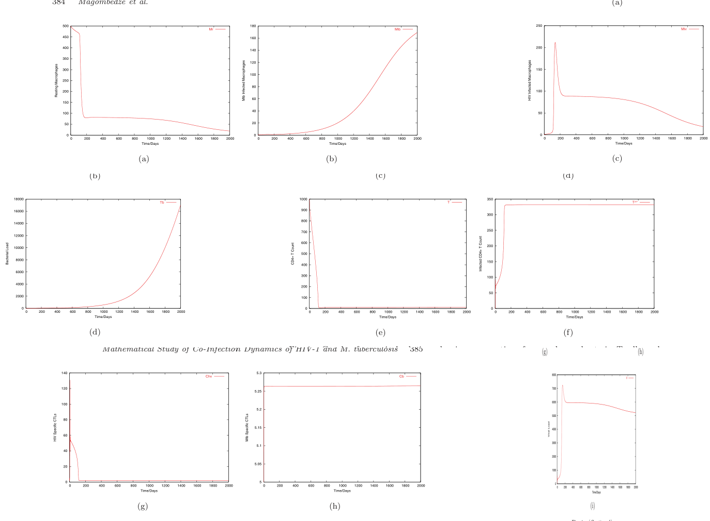
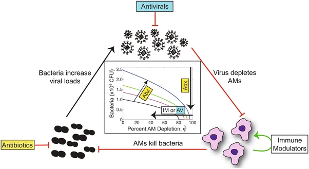
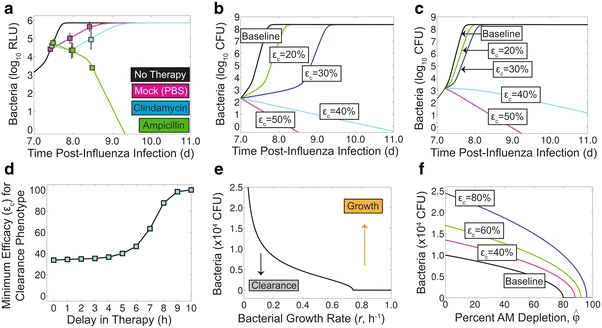

## Introduction

- Pathogens at times interact.
- Interaction can be direct or -- more common -- immune system mediated.
- Important interactions among pathogens:
	- HIV + TB (and HIV with others)
	- flu + bacteria
	- helminths + malaria/allergies
- Coinfection models range from relatively simple to very complex.
- There is nothing fundamentally different between these and the models we have seen so far.

## Coinfection models

- Models have been used to study coinfection.
- The models range from relatively simple to very complex.
- We'll briefly look at a few examples.
- There is nothing fundamentally different between these and the models we have seen so far.

__Notes:__ 

* Most model equations in this slide-deck were generated by ChatGPT based on the original papers and not checked for accuracy.
* Examples were chosen purely based on model suitability.

## TB/HIV model example 

"In‑vivo mathematical study of co‑infection dynamics of HIV‑1 and M tuberculosis", [Magombedze et al 2008, JBS](https://doi.org/10.1142/S0218339008002551). 

Question: How do HIV and TB influence each other to impact infection outcomes.

Approach: Combined TB and HIV model, explored to understand how interactions among pathogens and the immune response influence infection outcomes.

## TB/HIV model example - TB model

$$
\begin{align}
\dot{M}_r   &= s_m + p_m\,T_b\,M_r - k_i\,T_b\,M_r - \mu_m\,M_r
              && \text{resting macrophages} \\
\dot{M}_{ib} &= k_i\,T_b\,M_r
               - k_b\,M_{ib}
               - k_a\,\frac{M_{ib}}{M_{ib}+A}\,T
               - k_l\,M_{ib}\,C_b
               - \mu_{mi}\,M_{ib}
               && \text{infected macrophages} \qquad \\
\dot{T}_b   &= k_b\,N_b\,M_{ib}
              - \gamma_1\,T_b\,M_r
              - \gamma_2\,T_b\,C_b
              + r_m\,T_b
              + k_l\,N_c\,M_{ib}\,C_b
              && \text{extracellular Mtb} \\
\dot{T}     &= s_t + r_1\,\frac{T\,T_b}{T_b + B} - \mu_t\,T
              && \text{CD4$^{+}$T cells} \\[4pt]
\dot{C}_b   &= s_b + p_b\,\frac{M_{ib}}{M_{ib} + R_b}\,T\,C_b - \mu_{cb}\,C_b
              && \text{Mtb‑specific CTL}
\end{align}
$$

## TB/HIV model example - HIV model

$$
\begin{align}
\dot{T} &= s_t 
          + r\,\frac{T\,V}{V + A_a}
          - \beta\,\frac{V\,T}{1 + a_1\,C_{hv}}
          - r_2\,\frac{T\,V}{T + R}
          - \mu_t\,T
          && \text{CD4$^+$ T cells} \\
\dot{T}^* &= \beta\,\frac{V\,T}{1 + a_1\,C_{hv}}
            - h_v\,T^* C_{hv}
            - \alpha_t\,T^*
            && \text{HIV-infected CD4$^+$ T cells} \\[6pt]
\dot{C}_{hv} &= s_v + p_v\,V\,T\,C_{hv} - \mu_{cv}\,C_{hv}
              && \text{HIV-specific CTLs} \\[6pt]
\dot{V} &= \frac{N_v\,\alpha_t\,T^*}{1 + a_2\,C_{hv}} - \mu_v\,V
          && \text{free HIV virions}
\end{align}
$$

## TB/HIV model example - combined model

::: {.small}
$$
\begin{align}
\dot{M}_r   &= s_m + p_m\bigl(r_o V + T_b\bigr)M_r
              - k_v\,\frac{V M_r}{1 + a_o C_{hv}}
              - k_i\,T_b M_r - \mu_m\,M_r
              && \text{resting macrophages}  % :contentReference[oaicite:10]{index=10} \\[6pt]
\\[6pt]
\dot{M}_{ib} &= k_i\,T_b M_r
               - k_b\,M_{ib}
               - k_a\,\frac{M_{ib}}{M_{ib} + A}\,T
               - k_l\,M_{ib} C_b
               - \mu_{mi}\,M_{ib}
               && \text{Mtb–infected macrophages}  % :contentReference[oaicite:11]{index=11} \\[6pt]
\\[6pt]
\dot{M}_{iv} &= k_v\,\frac{V M_r}{1 + a_o C_{hv}}
               - h_m\,M_{iv} C_{hv}
               - m_b\,M_{iv}
               && \text{HIV‑infected macrophages}  % :contentReference[oaicite:12]{index=12} \\[6pt]
\\[6pt]
\dot{T}_b &= k_b N_b M_{ib}
            - \gamma_1 T_b M_r
            - \gamma_2 T_b C_b
            + r_m T_b
            + k_l N_c M_{ib} C_b
            && \text{extracellular Mtb}  % :contentReference[oaicite:13]{index=13} \\[6pt]
\\[6pt]
\dot{T}   &= s_t
            + r\,\frac{T V}{V + A_a}
            + r_1\,\frac{T T_b}{T_b + B}
            - \beta\,\frac{V T}{1 + a_1 C_{hv}}
            - r_2\,\frac{T V}{T + R}
            - \mu_t\,T
            && \text{healthy CD4 T cells}  % :contentReference[oaicite:14]{index=14} \\[6pt]
\\[6pt]
\dot{T}^{\ast} &= \beta\,\frac{V T}{1 + a_1 C_{hv}}
                - h_v\,T^{\ast} C_{hv}
                - \alpha_t\,T^{\ast}
                && \text{HIV‑infected CD4 T cells}  % :contentReference[oaicite:15]{index=15} \\[6pt]
\\[6pt]
\dot{C}_{hv} &= s_v + p_v\,V T C_{hv} - \mu_{cv}\,C_{hv}
              && \text{HIV‑specific CTLs} \\[6pt]
\dot{C}_b &= s_b + p_b\,\frac{M_{ib}}{M_{ib} + R_b}\,T C_b - \mu_{cb}\,C_b
           && \text{Mtb‑specific CTLs}  % :contentReference[oaicite:17]{index=17} \\[6pt]
\\[6pt]
\dot{V} &= \frac{N_v\,\alpha_t\,T^{\ast}}{1 + a_2 C_{hv}}
          + \frac{N_m\,m_b\,M_{iv}}{1 + a_3 C_{hv}}
          - \mu_v\,V
          && \text{free HIV virions}  % :contentReference[oaicite:18]{index=18}
\end{align}
$$
:::

## TB/HIV model example

## Influenza and bacteria example

"Quantifying the therapeutic requirements and potential for combination therapy to prevent bacterial coinfection during influenza" by [Amber Smith, 2017 JPP](https://link.springer.com/article/10.1007/s10928-016-9494-9)

Question: What is the impact of antiviral or antibacterial drugs during influenza-bacteria co-infections?

Approach: Exploration of several fairly simple mathematical models, comparison with data.

## Influenza and bacteria example

## Influenza and bacteria example

$$
\begin{align}
\dot{T}   &= -\beta\,T\,V
            && \text{(susceptible target cells \(T\))} \\[4pt]
\dot{I}_1 &= \beta\,T\,V - k\,I_1 - \mu\,P\,I_1
            && \text{(eclipse‑phase infected cells \(I_1\))} \\[4pt]
\dot{I}_2 &= k\,I_1 - \delta I_2 - \mu\,P\,I_2
            && \text{(virus‑producing infected cells \(I_2\))} \\[4pt]
\dot{V}   &= p\,I_2 - c\,V
            && \text{(free virus \(V\))} \\[4pt]
\end{align}
$$

## Influenza and bacteria example

$$
\begin{align}
\dot{T}   &= -\beta\,T\,V
            && \text{(susceptible target cells \(T\))} \\[4pt]
\dot{I}_1 &= \beta\,T\,V - k\,I_1 - \mu\,P\,I_1
            && \text{(eclipse‑phase infected cells \(I_1\))} \\[4pt]
\dot{I}_2 &= k\,I_1 - \delta I_2 - \mu\,P\,I_2
            && \text{(virus‑producing infected cells \(I_2\))} \\[4pt]
\dot{V}   &= (1+\color{red}{aP^z})p I_2 - c\,V
            && \text{(free virus \(V\))} \\[4pt]
\dot{P}   &= r\,P\!\left(1 - \frac{P}{K_P\!\bigl(1 + \psi V\bigr)}\right) \\
          &  - \gamma_{M_A} \frac{n^x M_A}{P^x+n^x M_A}  M_A P\bigl(1 - \frac{\phi V}{(K_{PV}+V)}\bigr)
            && \text{(pneumococcal bacteria \(P\))}
\end{align}
$$
$M_A$ are macrophages, not explicitly modeled, kept fixed.

## Influenza and bacteria example

$$
\begin{align}
\dot{T}   &= -\beta\,T\,V
            && \text{(susceptible target cells \(T\))} \\[4pt]
\dot{I}_1 &= \beta\,T\,V - k\,I_1 - \mu\,P\,I_1
            && \text{(eclipse‑phase infected cells \(I_1\))} \\[4pt]
\dot{I}_2 &= k\,I_1 - \delta I_2 - \mu\,P\,I_2
            && \text{(virus‑producing infected cells \(I_2\))} \\[4pt]
\dot{V}   &= \color{red}{(1-\epsilon_v)} (1+aP^z) p I_2 - c\,V
            && \text{(free virus \(V\))} \\[4pt]
\dot{P}   &= r\,P\!\left(1 - \frac{P}{K_P\!\bigl(1 + \psi V\bigr)}\right) \\
          &  - \gamma_{M_A} \frac{n^x M_A}{P^x+n^x M_A}  M_A P\bigl(1 - \frac{\phi V}{(K_{PV}+V)}\bigr) -\color{red}{\epsilon_a P}
            && \text{(pneumococcal bacteria \(P\))}
\end{align}
$$
More alternatives discussed in the paper.

## Influenza and bacteria example

## Summary

- Coinfection models are generally a bit larger since they need to account for both pathogens.
- One needs to know (or assume) the underlying interaction processes.
- Models are most useful at potentially discriminating between different possible mechanisms.

