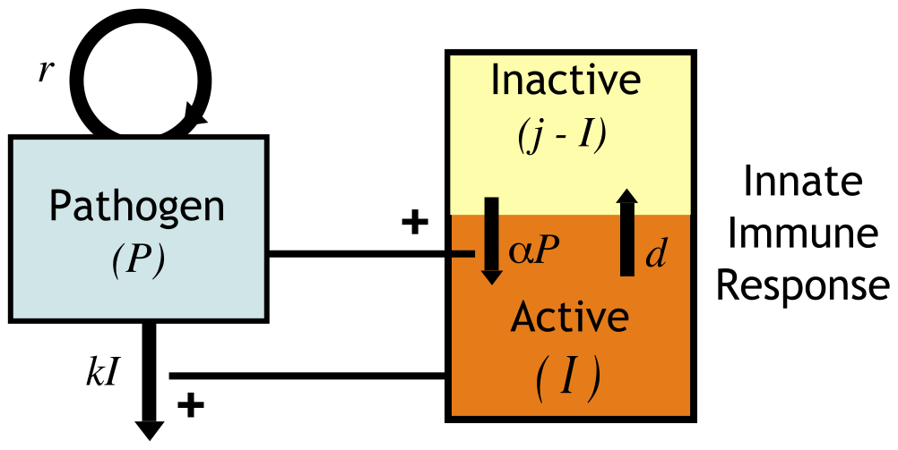
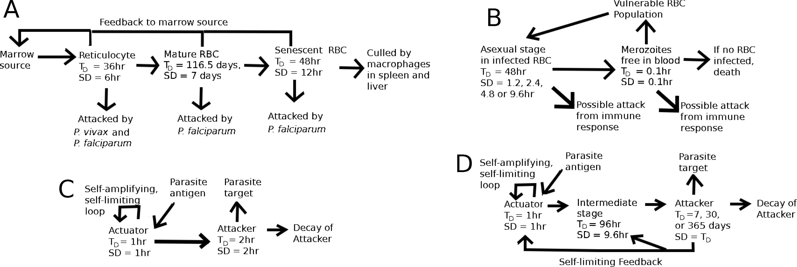
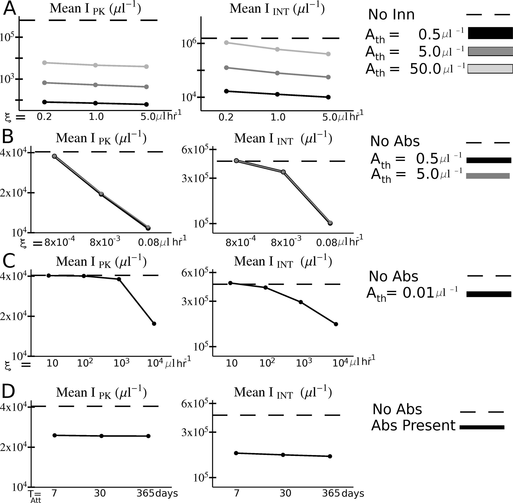
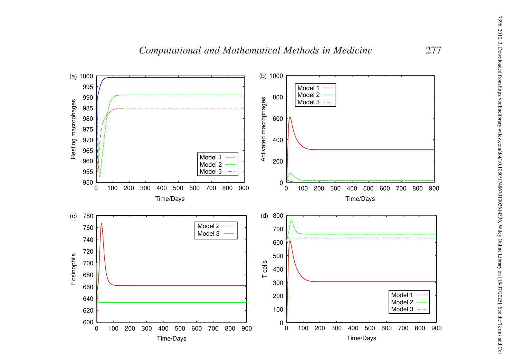
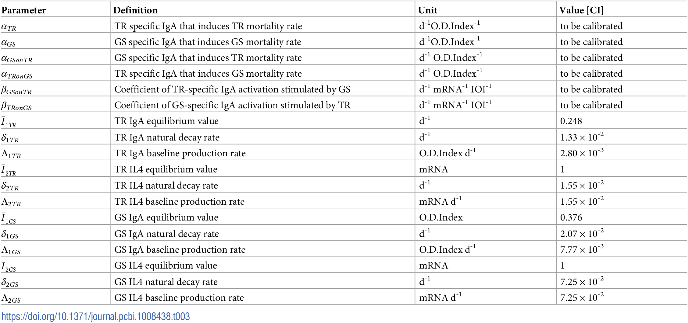
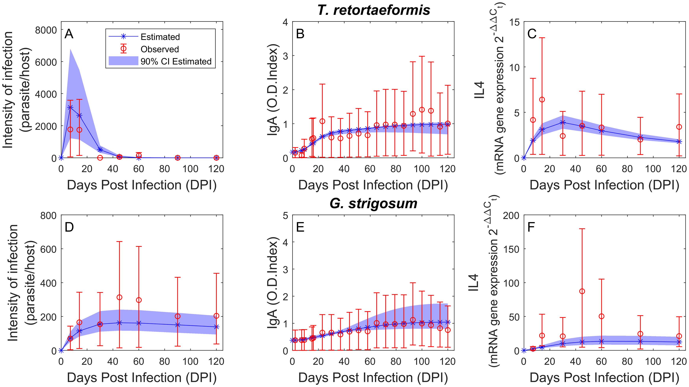
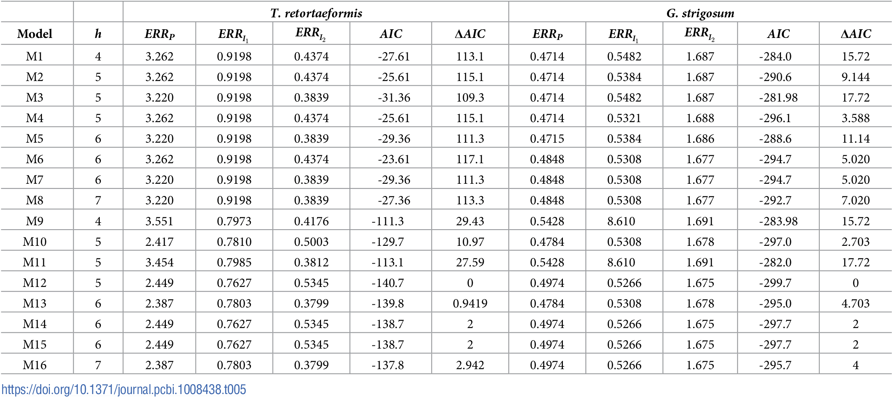

## Introduction

- Macroparasites are "big things" (> bacteria)
- Mostly extracellular  
- Important for human health:
  - Malaria
  - Worms/Helminths
 

## Parasite Infection models

- Models have been used to study parasite infections, though less than for common viruses and bacteria.
- The models range from relatively simple to very complex.
- We'll briefly look at a few examples.
- There is nothing fundamentally different between these and the models we have seen so far.

__Notes:__ 

* Most model equations in this slide-deck were generated by ChatGPT based on the original papers and not checked for accuracy.
* Examples were chosen purely based on model suitability.

## Malaria Example 1

"On the Control of Acute Rodent Malaria Infections by Innate Immunity" by [Kochin et al (2010) PLoS One](https://journals.plos.org/plosone/article?id=10.1371/journal.pone.0010444).

Question: Can differences in innate immunity explain infection patterns of different malaria strains?

Approach: Simple mathematical model fit to data from rodent malaria co-infections with two malaria strains (AJ and AS). Quality of fit is used to discriminate between model variants/hypotheses.

## Malaria Example 1

$$
\begin{aligned}
\dot{P} & = r P - k P I \qquad & \textrm{Pathogen}\\
\dot{I} & = \alpha P (j-I) - d I \qquad  & \textrm{Innate IR}
\end{aligned}
$$

{fig-align="center"}

## Malaria Example 1

$$
\begin{aligned}
\dot{P_{AJ}} & = r_{AJ} P_{AJ} - k_{AJ}P_{AJ} I \qquad & \textrm{AJ strain}\\
\dot{P_{AS}} & = r_{AS} P_{AS} - k_{AS}P_{AS} I \qquad & \textrm{AS strain}\\
\dot{I} & = (\alpha_{AS} P_{AS} + \alpha_{AJ} P_{AJ}) (j-I) - d I \qquad & \textrm{Innate IR}
\end{aligned}
$$

* Simple model
* Ignores intracellular processes
* Only a single equation for innate immune response

## Malaria Example 1

{fig-align="center"}

## Malaria Example 2

"Host Control of Malaria Infections: Constraints on Immune and Erythropoeitic Response Kinetics" by [McQueen & McKenzie (2008) PLoS Comp Bio](https://journals.plos.org/ploscompbiol/article?id=10.1371/journal.pcbi.1000149).

Question: Which components of the immune response help to control malaria infections?

Approach: Complex mathematical model explored for different parameter values.

## Malaria Example 2

{fig-align="center"}

## Malaria Example 2 

::: {.small}
$$
\begin{align}
\dot{I}_1 &= f\,m\,V - \Bigl(k_I + \sum_m \mathrm{Att}_m\,j_{m,1}\Bigr) I_1 
            && \text{(young infected‑RBC compartment \(I_1\))} \\[4pt]
\dot{I}_n &= k_I I_{n-1} - \Bigl(k_I + \sum_m \mathrm{Att}_m\,j_{m,n}\Bigr) I_n 
            && \text{(infected‑RBC compartment \(I_n\), $2\le n\le N_{cI}+1$)} \\[8pt]
\dot{m}   &= p\,k_I I_{N_{cI}} 
            - m\!\left(f\,V + \tfrac{1}{T_{Dm}}\right) 
            - m\sum_m \mathrm{Att}_m\,j_{m,m} + L(t) 
            && \text{(merozoite density \(m\))} \\[8pt]
\dot{R}_1 &= E_S(t) - k_R R_1 - f\,m\,R_1 
            && \text{(first reticulocyte compartment \(R_1\))} \\[4pt]
\dot{R}_n &= k_R R_{n-1} - (k_R + f\,m) R_n 
            && \text{(reticulocyte compartment \(R_n\), $2\le n\le N_{cR}+1$)} \\[8pt]
\dot{M}_1 &= k_R R_{N_{cR}} - k_M M_1 - f\,m\,M_1 
            && \text{(first mature‑RBC compartment \(M_1\))} \\[4pt]
\dot{M}_n &= k_M M_{n-1} - (k_M + f\,m) M_n 
            && \text{(mature‑RBC compartment \(M_n\), $2\le n\le N_{cM}+1$)} \\[8pt]
\dot{S}_1 &= k_M M_{N_{cM}} - k_S S_1 - f\,m\,S_1 
            && \text{(first senescent‑RBC compartment \(S_1\))} \\[4pt]
\dot{S}_n &= k_S S_{n-1} - (k_S + f\,m) S_n 
            && \text{(senescent‑RBC compartment \(S_n\), $2\le n\le N_{cS}+1$)} \\[8pt]
\dot{E}_S &=
  \begin{cases}
    \lambda_{ES}\,(W - E_S),          & E_{SMN} < W < E_{SMX} \\[4pt]
    \lambda_{ES}\,(E_{SMX} - E_S),    & W > E_{SMX} \\[4pt]
    \lambda_{ES}\,(E_{SMN} - E_S),    & W < E_{SMN}
  \end{cases}
  && \text{(marrow RBC‑production rate \(E_S\))}
\end{align}
$$
:::

## Malaria Example 2

::: {.small}
$$
\begin{align}
\dot{\mathrm{Act}} &= H(S_{\mathrm{Act}}) - \lambda_{\mathrm{Act}}\,\mathrm{Act}                      && \text{(innate actuator)} \\[4pt]
\dot{\mathrm{Att}} &= H(S_{\mathrm{Att}}) - \lambda_{\mathrm{Att}}\,\mathrm{Att}                      && \text{(innate attacker)} \\
\dot{\mathrm{Act}} &= H(S_{\mathrm{Act}}) - \lambda_{\mathrm{Act}}\,\mathrm{Act}                      && \text{(adaptive actuator)} \\[4pt]
\dot{G}_1          &= H\!\bigl(\lambda_{\mathrm{Act}}\mathrm{Act}-S_{G,\mathrm{th}}\bigr) 
                     - k_G G_1 && \text{(growth‑phase compartment \(G_1\))} \\[4pt]
\dot{G}_n          &= k_G G_{n-1} - k_G G_n 
                     && \text{(growth‑phase compartment \(G_n\), $2\le n\le N_{cG}+1$)} \\[4pt]
\dot{\mathrm{Att}} &= H(S_{G,\mathrm{Att}}) - \lambda_{\mathrm{Att}}\,\mathrm{Att} 
                     && \text{(adaptive attacker)}
\end{align}
$$
:::

## Malaria Example 2

{fig-align="center"}

## Worm Infection Example 1

“Modelling within‑host parasite dynamics of schistosomiasis” by [Chiyaka et al 2010 CMMM](https://www.tandfonline.com/doi/full/10.1080/17486701003614336).

Question: How can within-host parasite dynamics be controlled by different parts of the immune response?

Approach: Medium-size mathematical model explored for different parameter values.

## Worm Infection Example 1

$$
\begin{align}
\dot{L}   &= \lambda\,f(L,E) - \bigl(m_L + \mu_L + d_L\bigr)\,L, 
            && \text{(larval stage \(L\))}\\[4pt]
\dot{W}_I &= m_L\,L - \bigl(m_I + \mu_I + d_I\bigr)\,W_I, 
            && \text{(immature worms \(W_I\))}\\[4pt]
\dot{W}_P &= \tfrac{1}{2}m_I\,W_I - \bigl(m_P + \mu_P\bigr)\,W_P, 
            && \text{(paired adult worms \(W_P\))}\\[4pt]
\dot{E}   &= m_P\,N_E\,W_P - \bigl(m_E + \mu_E\bigr)\,E, 
            && \text{(eggs \(E\))}\\[8pt]
\dot{M}_R &= s_R + r_R\bigl(L + W_T + E\bigr)M_R             && \text{(resting macrophages \(M_R\))}\\[4pt]
          &  - s_A\bigl(L + W_T + E\bigr)M_R 
            + \beta_A\,M_A - \mu_R\,M_R, \\
\dot{M}_A &= s_A\bigl(L + W_T + E\bigr)M_R 
            - \beta_A\,M_A - \mu_A\,M_A, 
            && \text{(activated macrophages \(M_A\))}\\[4pt]
\dot{T}   &= s_T + r_T\bigl(E + M_R + M_A\bigr)T - \mu_T\,T.
            && \text{(T cells \(T\))}
\end{align}
$$

More equations for model variants discussed in the paper.

## Worm Infection Example 1

{fig-align="center"}

## Worm Infection Example 2

"Within-host mechanisms of immune regulation explain the contrasting dynamics of two helminth species in both single and dual infections", [Vanalli et al, 2020 PLoS Comp Bio](https://journals.plos.org/ploscompbiol/article?id=10.1371/journal.pcbi.1008438).

Question: How does the interaction between parasites and the immune response lead to different infection outcomes for single or coinfections of rabbits with 
_Trichostrongylus retortaeformis_ and _Graphidium strigosum_?

Approach: 16 variants of fairly simple mathematical models were explored and fit to data to distinguish different immune processes/hypotheses.

## Worm Infection Example 2

$$
\begin{align}
\dot P_i   &= \sigma_i L_{0i} e^{-k_i t} \;-\; \mu\,P_i \;-\; \alpha_i I_{1i} P_i,
             && \text{parasite intensity}\\[4pt]
\dot I_{1i} &= \beta_{1i}\, I_{1i}^{a_i} I_{2i}^{c_i} P_i^{d_i} \;-\; \delta_{1i} I_{1i} \;+\; \Lambda_{1i},
             && \text{species-specific IgA}\\[4pt]
\dot I_{2i} &= \beta_{2i}\, I_{2i}^{b_i} P_i \;-\; \delta_{2i} I_{2i} \;+\; \Lambda_{2i},
             && \text{IL4 response}
\end{align}
$$

i indexes the pathogen type.

## Worm Infection Example 2

$$
\begin{align}
\dot P_{\mathrm{TR}} &= \sigma_{\mathrm{TR}} L_{0,\mathrm{TR}} e^{-k_{\mathrm{TR}} t}
                       - \mu P_{\mathrm{TR}}
                       - \alpha_{\mathrm{TR}} I_{1,\mathrm{TR}} P_{\mathrm{TR}}
                       - \alpha_{\mathrm{GS},\mathrm{TR}} I_{1,\mathrm{GS}} P_{\mathrm{TR}} \\[4pt]
\dot P_{\mathrm{GS}} &= \sigma_{\mathrm{GS}} L_{0,\mathrm{GS}} e^{-k_{\mathrm{GS}} t}
                       - \mu P_{\mathrm{GS}}
                       - \alpha_{\mathrm{GS}} I_{1,\mathrm{GS}} P_{\mathrm{GS}}
                       - \alpha_{\mathrm{TR},\mathrm{GS}} I_{1,\mathrm{TR}} P_{\mathrm{GS}} \\[4pt]
\dot I_{1,\mathrm{TR}} &= \beta_{1,\mathrm{TR}} I_{1,\mathrm{TR}}^{a_{\mathrm{TR}}}
                         I_{2,\mathrm{TR}}^{c_{\mathrm{TR}}} P_{\mathrm{TR}}^{d_{\mathrm{TR}}}
                         + \beta_{1,\mathrm{GS},\mathrm{TR}}
                           I_{2,\mathrm{GS}}^{c_{\mathrm{GS},\mathrm{TR}}}
                         - \delta_{1,\mathrm{TR}} I_{1,\mathrm{TR}}
                         + \Lambda_{1,\mathrm{TR}} \\[4pt]
\dot I_{1,\mathrm{GS}} &= \beta_{1,\mathrm{GS}} I_{1,\mathrm{GS}}^{a_{\mathrm{GS}}}
                         I_{2,\mathrm{GS}}^{c_{\mathrm{GS}}} P_{\mathrm{GS}}^{d_{\mathrm{GS}}}
                         + \beta_{1,\mathrm{TR},\mathrm{GS}}
                           I_{2,\mathrm{TR}}^{c_{\mathrm{TR},mathrm{GS}}}
                         - \delta_{1,\mathrm{GS}} I_{1,\mathrm{GS}}
                         + \Lambda_{1,\mathrm{GS}} \\[4pt]
\dot I_{2,\mathrm{TR}} &= \beta_{2,\mathrm{TR}} I_{2,\mathrm{TR}}^{b_{\mathrm{TR}}} P_{\mathrm{TR}}
                         - \delta_{2,\mathrm{TR}} I_{2,\mathrm{TR}}
                         + \Lambda_{2,\mathrm{TR}} \\[4pt]
\dot I_{2,\mathrm{GS}} &= \beta_{2,\mathrm{GS}} I_{2,\mathrm{GS}}^{b_{\mathrm{GS}}} P_{\mathrm{GS}}
                         - \delta_{2,\mathrm{GS}} I_{2,\mathrm{GS}}
                         + \Lambda_{2,\mathrm{GS}}
\end{align}
$$

## Worm Infection Example 2

{fig-align="center"}

## Worm Infection Example 2

{fig-align="center"}

## Worm Infection Example 2

{fig-align="center"}

## Summary

- There is nothing fundamentally different between macroparasite and virus/bacteria models.
- What is included and excluded in the model, and which processes are modeled, depends on the system, question and choices made by the modeler.
