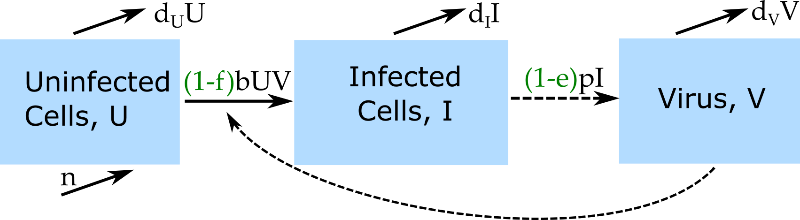
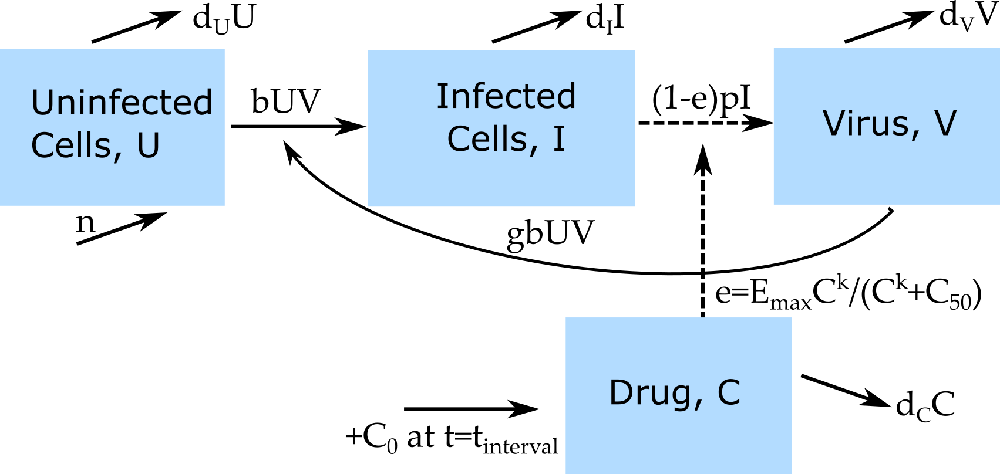

## Big picture

-   We generally want to understand pathogen-immune response dynamics with the goal of intervening with drugs or vaccines.
-   Modeling of drugs is a big area. In the pharma industry, this is knows as pharmacometrics (PM/PMX) or pharmacokinetic/pharmacodynamic (PK/PD) modeling. 
- For mechanistic models like ours, the term Quantitative Systems Pharmacology (QSP) is often used.
- PMX/QSP modeling goes beyond infectious diseases. You could build a model where instead of a pathogen, you have cancer cells, or some compartments describing renal function, or some neuro-receptors in the brain...

## General Idea

-   Build a model without an intervention that includes the components you are interested in:
    -   Pathogen
    -   Immune Response (optional)
-   Add drug/treatment into the model
- Explore the impact of the treatment/intervention on the outcomes of interest

## Example 1

-   IFN treatment for HCV infection
-   Question to answer: 
    * By what mechanism does the drug work?
    * How effective is the drug?

## Example 1



```{=tex}
\begin{align}
\dot U & = n - d_U U - \color{red}{(1-f)}bUV \\ 
\dot I & = \color{red}{(1-f)}bUV - d_I I \\
\dot V & = \color{blue}{(1-e)}pI - d_V V - \color{red}{(1-f)}gbUV
\end{align}
```
Simplest assumption: Drug effect is constant.


## Example 1

```{=tex}
\begin{align}
\dot U & = n - d_U U - \color{red}{(1-f)}bUV \\ 
\dot I & = \color{red}{(1-f)}bUV - d_I I \\
\dot V & = \color{blue}{(1-e)}pI - d_V V - \color{red}{(1-f)}gbUV
\end{align}
```

- We can explore if a model that acts through either of these two mechanisms (or neither or both) matches the data. 
- Usually, we fit the models to the data and get some statistical answer about which model fits the data better.
- As a simpler approach, we can run the model and visually compare its predictions to the data. 


## Example 1 Exercise

- The "Antiviral Treatment Model" in DSAIRM implements the model and guides you through a a set of tasks where you visually compare the model runs to data.
- The "Influenza Drug Model" uses the same model, but fits data to the model using a statistical approach (least squares).
- Explore either or both of these apps. Start by reading the _Overview_ and _Model_ sections. Then go through the tasks in the _What to do_ section. 
- If you are comfortable with R, you can also get and look at the code and interact with the model through writing your own R code. The _Further Information_ section tells you where to find the code. 


## Example 2

* Allow the drug concentration to change over time and have an explicit equation for the drug (Pharmacokinetics, PK).
* Have some more complex mapping from drug concentration to drug impact (Pharmacodynamics, PD).

{fig-align="center"}

## Example 2

Old:
```{=tex}
\begin{align}
\dot U & = n - d_U U - bUV \\
\dot I & = bUV - d_I I \\
\dot V & = (1-e)pI - d_V V - gb UV \\
\end{align}
```

New
```{=tex}
\begin{align}
e & = E_{max} \frac{C^k}{C^k+C_{50}} \qquad \textrm{(PD)} \\
\dot C & =  - d_C C \qquad \textrm{(PK)} \\
C & =C+C_0 \textrm{ at } t = t_{interval}  
\end{align}
```

* This is implemented in the _Pharmacokinetics and Pharmacodynamics_ app in DSAIRM. Explore at your own leisure.


## Example 3

$$
\begin{aligned}
\dot{B} & = g B(1-\frac{B}{B_{max}}) - d_B B - pBI \color{blue}{- f(C)B}\\
\dot{I} & = r BI - d_I I \\
\color{blue}{\dot{C}} & \color{blue}{= ?}
\end{aligned}
$$ 

A drug at concentration $C$ leads to extra killing of bacteria (PD). The drug has some time-course (PK).


## Example 3

$$
\begin{aligned}
\dot{B} & = g B(1-\frac{B}{B_{max}}) - d_B B - k_IBI  - eB\\
\dot{I} & = r BI - d_I I \\
\dot C & =  - d_C C, \qquad C=C+C_0 \textrm{ at } t = t_{interval} \qquad \textrm{(PK)}\\
e & = E_{max} \frac{C^n}{C^n+C_{50}} \qquad \textrm{(PD)}
\end{aligned}
$$

* The bad news: This model is not part of DSAIRM. 
* The good news: We can build it ourselves! (**DSAIRM Level 3.**)


## Hands-on exercise

* Get the code/simulation model for the Basic Bacteria model and the PK/PD model, namely `simulate_basicbacteria_ode.R` and `simulate_pkpdmodel_ode.R`. 

* Take a look at both R files. All the stuff at the top (any line that starts with `#'`) is just documentation and you can mostly ignore.

* Make a copy of `simulate_pkpdmodel_ode.R`. You can delete the documentation portion. Modify the code by replacing the $U/I/V$ part of the model with the $B/I$ part from the bacteria model.

* Definitions/letters for some parameters might have changed between apps. Make sure you call/define them correctly.

* This might be a bit challenging, but we'll assist.