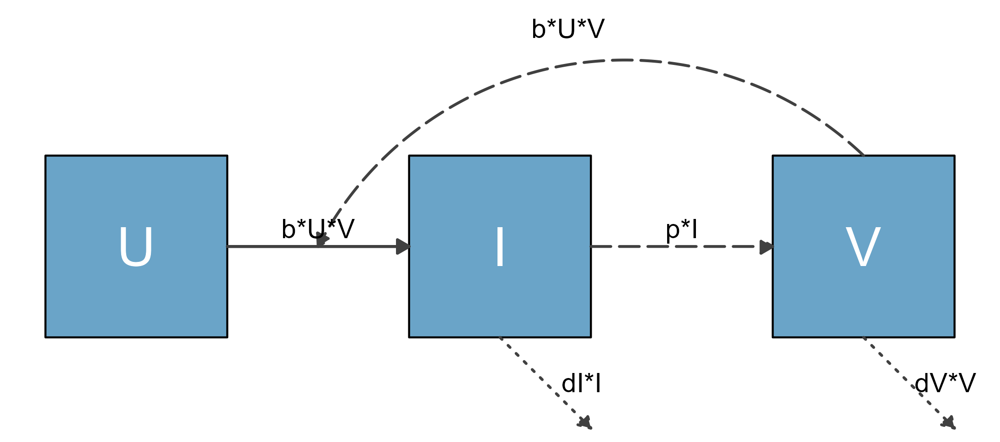
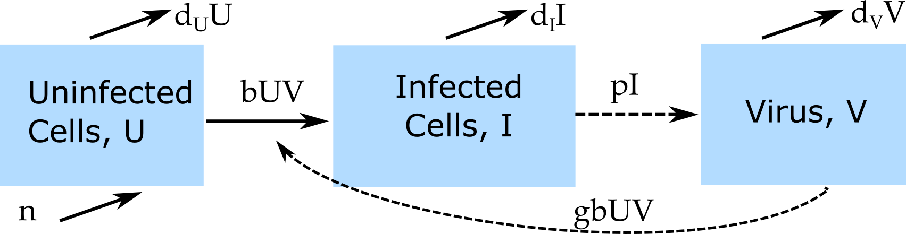
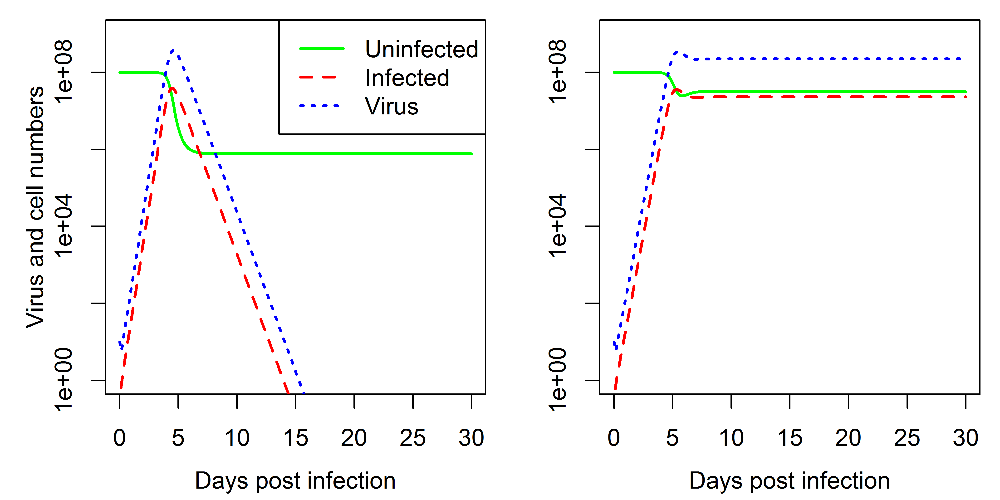
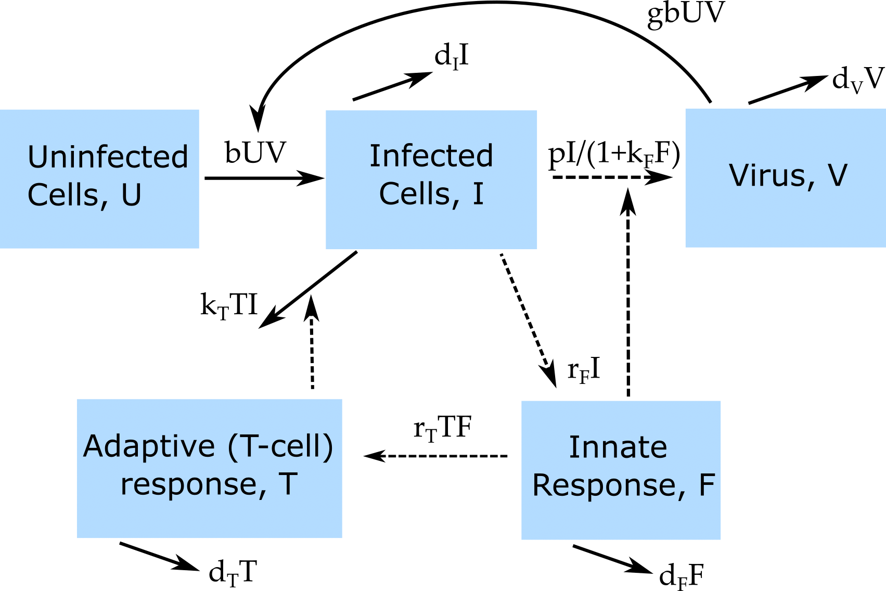
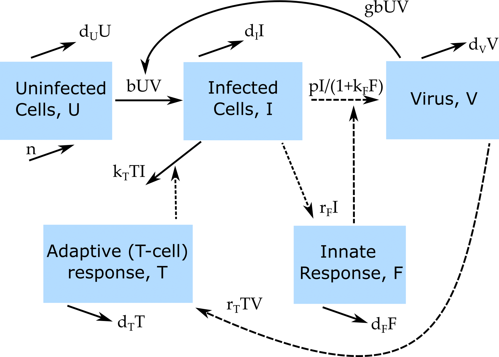
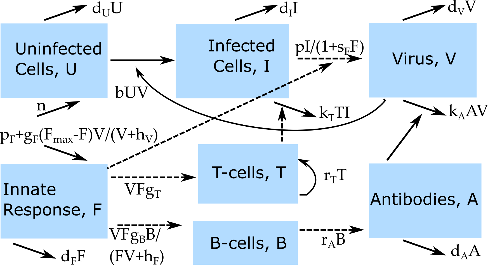

## Approximate virus infection model

$$
\begin{aligned}
\dot{V} & = g V(1-\frac{V}{V_{max}}) - d_V V - kVI\\
\dot{I} & = r VI - d_I I
\end{aligned}
$$

* Simple.
* Not very mechanistic.
* Can lead to patterns that are not too realistic.

## Basic acute virus infection model

{fig-align="center"}

$$
\begin{aligned}
\textrm{Uninfected Cells} \qquad \dot{U} & =  ? \\
\textrm{Infected Cells} \qquad \dot{I} & =  ? \\     
\textrm{Virus} \qquad  \dot{V} & =  ? 
\end{aligned}
$$

## Basic acute virus infection model

{width="70%" fig-align="center"}

$$
\begin{aligned}
\textrm{Uninfected Cells} \qquad \dot{U} & =   - bUV \\
\textrm{Infected Cells} \qquad \dot{I} & =  bUV - d_I I \\     
\textrm{Virus} \qquad  \dot{V} & =  pI - d_V V -  bg UV 
\end{aligned}
$$

## Basic chronic virus infection model

{width="70%" fig-align="center"}

$$
\begin{aligned}
\textrm{Uninfected Cells} \qquad \dot{U} & = \color{blue}{n -d_U U} - bUV \\
\textrm{Infected Cells} \qquad \dot{I} & =  bUV - d_I I \\     
\textrm{Virus} \qquad  \dot{V} & =  pI - d_V V -  bg UV 
\end{aligned}
$$

## Basic virus infection models

{width="80%" fig-align="center"}

## Notation variability
* I'm trying to use the same letters for variables and parameters in these materials.
* If you read the literature, you'll see all kinds of variants.

$$
\dot{T} = s - uT - \beta T V \\
\dot{T^*}  =  \beta T V - d T^* \\
\dot{V}  =  NdT^* - c V -  \beta g TV 
$$
$$
\dot{x} = \lambda - dx - \beta x v \\
\dot{y}  =  \beta x v - a y \\
\dot{v}  =  \kappa y - u v -  \beta g xv 
$$

## Diagrams and Models
* It is important to go back and forth between words, diagrams, equations.
* Diagrams specify a model somewhat, but not completely. 

## Diagrams and Models
The virus model diagram could be implemented as continuous or discrete (or stochastic) model.

{width="70%" fig-align="center"}

$$
\begin{aligned}
\dot{U} & = n -d_U U - bUV \\
\dot{I} & =  bUV - d_I I \\     
\dot{V} & =  pI - d_V V -  bg UV 
\end{aligned}
$$

$$
\begin{aligned}
U_{t+dt} & = U_{t} + dt(n -d_U U_t - bU_tV_t) \\
I_{t+dt} & = I_{t} + dt( bU_tV_t - d_I I_t )\\     
V_{t+dt} & = V_{t} + dt( pI_t - d_V V_t -  bg U_t V_t ) 
\end{aligned}
$$

## Model Exploration
Explore the "Basic Virus Model" app in DSAIRM

## Virus and Immune Response Models
* The immune response is incredibly complex, we still don't know how to model it in much detail.
* We can nevertheless build and explore models that are a (hopefully) good balance between realism and abstraction.

## Virus and Immune Response Model 1

* **U** - uninfected cells 
* **I** - infected cells
* **V** - (free) virus
* **F** - innate (interferon) response
* **T** - adaptive (T-cell) response

## Virus and Immune Response Model 1

{width="70%" fig-align="center"}

## Virus and Immune Response Model 1

\begin{aligned}
\dot U & = - b U V  \\
\dot I & = b U V - d_I I - k_T T I   \\
\dot V & = \frac{p}{1+k_F F}I - d_V V - gb UV \\
\dot F & = r_F I - d_F F \\
\dot T & = r_T T F - d_T T
\end{aligned}

## Virus and Immune Response Model 2

* **U** - uninfected cells 
* **I** - infected cells
* **V** - (free) virus
* **F** - innate (interferon) response
* **T** - adaptive (T-cell) response

## Virus and Immune Response Model 2

{width="70%" fig-align="center"}

## Virus and Immune Response Model 2

\begin{aligned}
\dot U & = n - d_U U - b U V  \\
\dot I & = bUV - d_I I - k_T T I   \\
\dot V & = \frac{p}{1+k_F F}I - d_V V - gb UV \\
\dot F & = r_F I - d_F F \\
\dot T & = r_T T V - d_T T
\end{aligned}

## Models 1 and 2

:::: {.columns}
::: {.column width="50%"}
\begin{aligned}
\dot U & = - b U V  \\
\dot I & = b U V - d_I I - k_T T I   \\
\dot V & = \frac{p}{1+k_F F}I - d_V V - gb UV \\
\dot F & = r_F I - d_F F \\
\dot T & = r_T T F - d_T T
\end{aligned}
:::

::: {.column width="50%"}
\begin{aligned}
\dot U & = \color{blue}{n - d_U U} - b U V  \\
\dot I & = bUV - d_I I - k_T T I   \\
\dot V & = \frac{p}{1+k_F F}I - d_V V - gb UV \\
\dot F & = r_F I - d_F F \\
\dot T & = \color{blue}{r_T T V} - d_T T
\end{aligned}
:::
::::

## Virus and Immune Response Model 3

* **U** - uninfected cells 
* **I** - infected cells
* **V** - (free) virus
* **F** - innate immune response
* **T** - CD8 T-cells
* **B** - B-cells
* **A** - Antibodies

## Model Diagram
{width="90%" fig-align="center"}

## Model Equations
$$
\dot U = n - d_U U - bUV\\ 
\dot I = bUV - d_I I - k_T T I\\
\dot V = \frac{pI}{1+s_F F} - d_V V - b UV - k_A AV \\
\dot F = p_F - d_F F + \frac{V}{V+ h_V}g_F(F_{max}-F)  \\ 
\dot T = F V g_T + r_T T\\
\dot B = \frac{F V}{F V + h_F} g_B B \\
\dot A = r_A B - d_A A - k_A A V
$$

## Model Exploration
Explore any/all of the "IR" models in the virus models section

<!-- ## Homework -->

<!-- * If you haven't already, take a look at the "Basic Bacteria Model" app and - in as much detail as you have time - go through the "What to do" tasks. You can try yourself first, or look at the solution right away. -->
<!-- * Take an especially close look at the solution for task 6, we will use a similar approach tomorrow. -->
<!-- * Link to solution file is in the schedule of the class website.  -->

