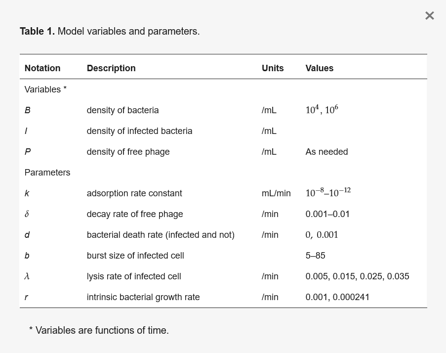
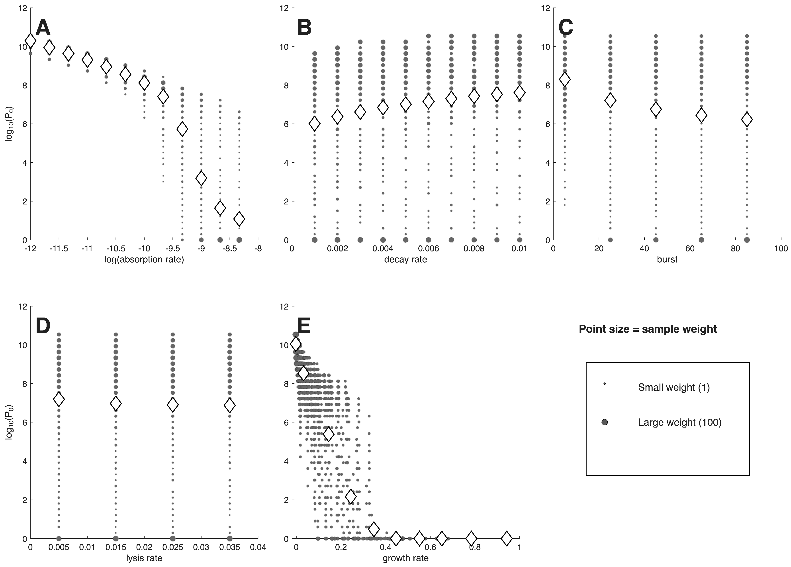
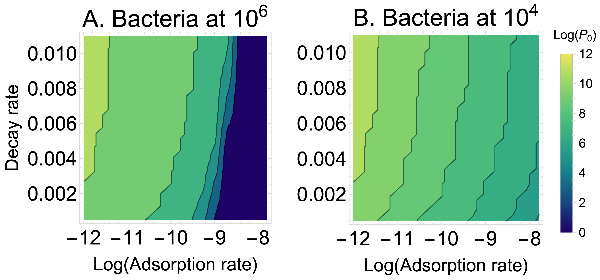

## (Bacterio)Phages

- [Are viruses of bacteria](https://en.wikipedia.org/wiki/Bacteriophage)
- Often kill bacteria (lytic phage)
- [Have been considered as treatment options](https://en.wikipedia.org/wiki/Phage_therapy)
- Have been studied with models

## Phage modeling example 

[Modeling the Phage Properties Best for Therapy](https://doi.org/10.3390/v18020240)

"...The approach here involves three conceptual steps. The first is to construct a computa-
tional model to represent an infection and possible treatments. Second, a criterion is chosen
to represent success versus failure from treatment. Third, different possible treatment
designs or variables (i.e., phage characteristics) are numerically investigated to decide how
often success results..."

## A phage model

$$
\begin{aligned}
\textrm{Uninfected Bacteria} \qquad \dot{B} & = rB - dB   - kBP \\
\textrm{Infected Bacteria} \qquad \dot{I} & =  kBP - d I  - \lambda I\\     
\textrm{Phage} \qquad  \dot{P} & =  b \lambda I - \delta P -  kBP 
\end{aligned}
$$

## A phage model

{fig-align="center"}

## Outcome as function of phage property 

* Outcome = number of phages needed to reduce bacteria 100-fold
* Phage property = parameter values of the model

{fig-align="center"}

## Results 

{fig-align="center"}

## Results 

{fig-align="center"}

## Conclusion

A mathematical model of phage therapy suggests which phage characteristics are most likely to impact treatment outcomes and thus should be prioritized when trying to improve phages.

