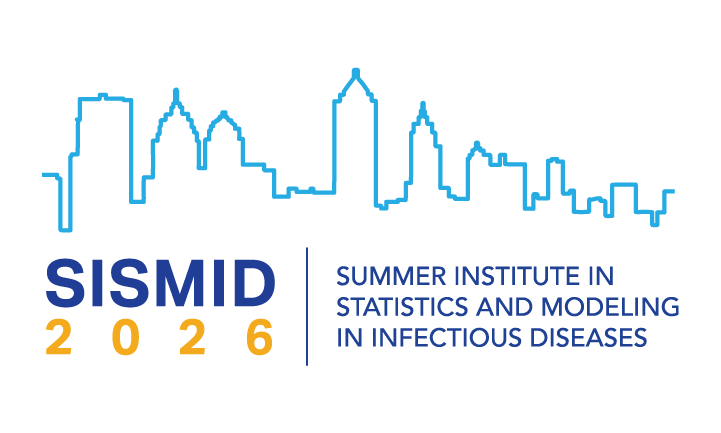

{width="200px" style="float:right" fig-alt="SISMID logo"}

Welcome to the website for the course/module called [Infectious Diseases, Immunology and Within-Host Models](https://sph.emory.edu/SISMID/modules/infectious-diseases-immunology/index.html), which is part of the [Summer Institute in Statistics and Modeling in Infectious Diseases (SISMID)](https://sph.emory.edu/SISMID/index.html). 

The course is taught by [Andreas Handel](https://www.andreashandel.com/) and [Paul Thomas](https://www.stjude.org/research/labs/thomas-lab.html). 

# Website content

The __Syllabus__ provides a brief overview with a few logistic details.

The __Schedule__ lists the topics, with links to materials. Some of the materials are on a separate site called [Simulation Modeling in Immunology](https://andreashandel.github.io/SMIcourse/) which we use as the main, permanent repository for teaching materials related to this course (and other workshops). 

The __Communication__ section provides information on how course communications are planned to happen.

The __Resources__ section contains a listing of the main sources and materials we will be using in this course, as well as links to further resources.

The __Project__ section has information and instructions for a - completely optional - course project you can do if you want. 

# Getting started

Start by briefly skimming through all pages on this website. Then go through and do everything listed in the __Before course start__ section of the __Schedule__ page. 

# Notes

We are a _Module_ of SISMID. However, for our purposes, we refer to our module as a _course_ or _class_, and use _module_ for individual segments, which are further divided into _units_. We hope this is not too confusing. 

By default, all links open in the current tab. You'll likely want external ones to open in a separate tab or window. To do so, you can (with most browsers) hold the `Ctrl` button when clicking, or do a right-click and select `open in new tab/window`.

  
